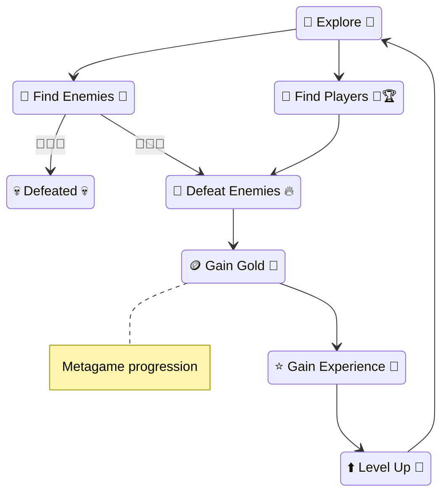
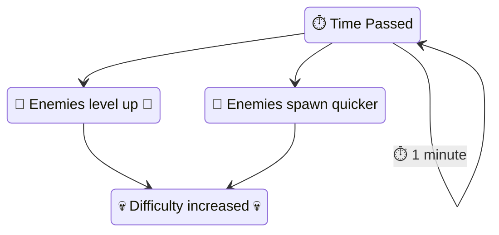
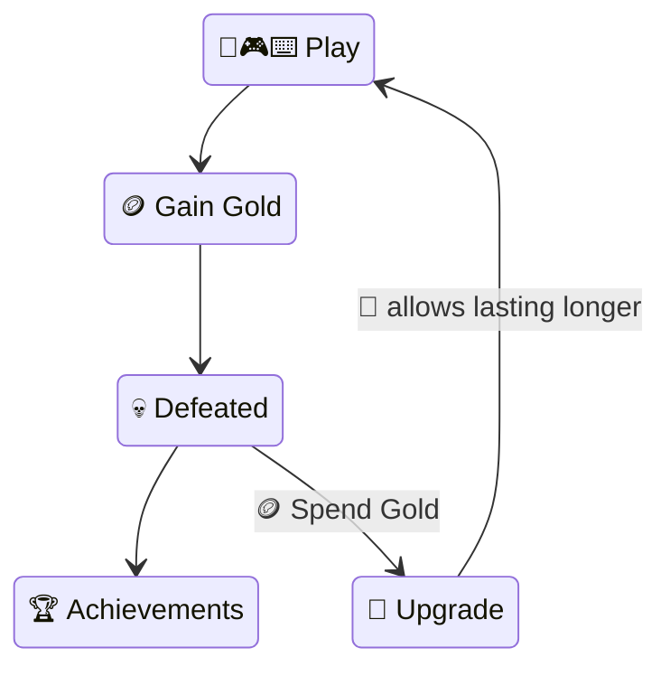

# To Do
* Design Pillars
* Gameplay Loop
* Level up faster than enemies get stronger (graphs)
* FTUE

## Player Motivations
### 🤝 Cooperation
Players will have lots of ways to cooperate directly with other players and are highly motivated to seek each other out and team up.
### 🏆 Competition
Teams will have metrics and achievements based on personal performance of individuals within their team.
### 🔥 Destruction
Players will be able to cause destruction to the environment and enemies in an over-the-top fireworks-display comical manner.
### 💪 Progression
Players will feel stronger in a single session during gameplay and upgrade their characters during the meta gameplay.
### 🔎 Discovery
Players will be able to discover different environments, characters, and enemies over their sessions.

## 🌀 Gameplay Loop 🌀

\* Icons on the right of each state indicate the player motivation.

## 🎯 Players Goal 🎯
The players🧙 goal is to gain as much gold🪙 as possible, allowing for upgrades💪 in the metagame. The longer the player stays alive the more gold🪙 is gained. 

Players are able to last longer by:
1. Leveling up faster💪 than enemies👹.
2. Finding players🧙 to group up with.
3. Starting stronger💪 (metagame).

## Meta Game Loop

