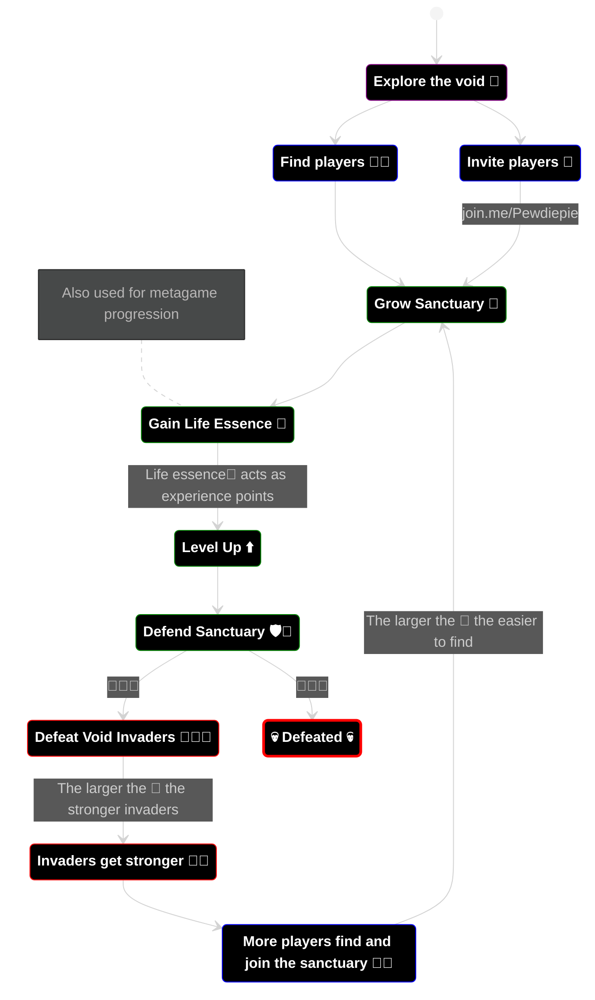

# To Do
* Design Pillars
* FTUE

----

## 🪜 Design Pillars 🪜

### Hyper Accessibility

### Community engager
* make leader feel important and be recognizable

### Shareable

### Multi-taskable

### Short Sessions
### Leave anytime, join anytime

### Positive reinforcement

----

## 🏃 Player Motivations 🏃
### 🤝 Cooperation
Players are highly motivated to seek each other out and team up. Players progress faster in groups, are able to help each other out directly using their character abilities.
### 🏆 Competition
Teams will have statistics of individual performance (damage, healing, ...) displayed at all times which will motivate players to top the team leaderboard.
### 🔥 Destruction
The combat will cause destruction to the environment and enemies in an over-the-top fireworks-display comical manner.
### 💪 Progression
In a short 15 minute session players will progress rapidly in their character and be reset at the end of the session. In the metagame players can empower their characters by expending currecny.
### 🔎 Discovery
Players will be able to discover a variety of unique and different environments, characters, and enemies over their sessions.

----

## 🌀 Gameplay Loop 🌀

----

## 🎯 Players Goal 🎯
The players🧙 goal is to gain as much life essence🌿 as possible. Life essence is used to upgrade characters💪 in the metagame. The longer the player is able to defend the sanctuary🌱, the more life essence is gained.

Players are able to last longer by:
1. Finding players🧙 to team up with by inviting them via a link🔗 or finding them in the void, which adds more defenders🛡️ to the sanctuary🌱.
2. Gathering life essence🌿 from the sanctuary efficently by avoiding taking damage💖 from enemies👹.
3. Starting stronger💪 by upgrading characters in the metagame using life essence🌿.

----

## 💪 Meta Game Loop 💪

---

## 🧝🧞🧙 Characters 🧙🧞🧝

---

## 🛠️ Mechanics 🛠️

---