This page defines the direction of the design for the game Void Survivors.

This document is a WIP and will be iterated upon during during the Pre-Production, Alpha, and Beta phases of the game's development as ideas are tested and validated in playtests. See [Development Plan](development-plan) for more info.

----

  

    Table of contents
  

  {: .text-delta }
1. TOC
{:toc}

----

## 👁️ Gameplay summary 👁️

LOGLINE

GAMEPLAY SUMMARY 

**SURVIVORS**

USP / THE HOOK

----

## 🪝 Hook
Play a fast paced swarm-defense bullet-heaven game in a group with **hundreds of other people**!\
Invite your friends and invite your community to play with you using one simple link!

**How it is familiar**:
* Familiar popular genres (swarm-defense, bullet-heaven).
* Familiar art style (voxel-based).

**How it differs**:
* Massively multiplayer. (no existing title in these genres)
* Easily invite anyone at anytime, with a link.
* Play immediately with no installation within a web browser, on almost any device.

Void survivors' gameplay will be familiar to a lot of gamers as it is similar to many other popular titles (Vampire Survivors) with one twist, it's massively-multiplayer! It is uniquely positioned in that no existing title in the Survivors-Like genre is massively multiplayer.

----

## 📛 Genres
Main Genre: MMO.
Sub Genres: Action RPG, Roguelite, Survivors-Like (Bullet-Heaven, Swarm-Defense).

### MMO (Massively-multiplayer Online)
Void Survivors is an online game playable with hundreds of other people on your team. It aims to band people together in large teams and is easily sharable and joinable, via a link and played on a web browser with no installation.

[Source: Youtube 'Bodomi'](https://www.youtube.com/watch?v=zKNG4w06ySQ)

Games in this genre that inspire Void Survivors: 
* [World of Warcraft - 40 person Raids](https://youtu.be/UwVNpHaFhUI?t=2470)

### Action RPG
Void Survivors is an action game where teams will defend against waves of invaders from destroying their sanctuary🌱. Players use auto-attacks and a variety of abilities to defeat invaders.

[Source: Steam](https://store.steampowered.com/app/2088570/Tiny_Rogues/)

Games in this genre that inspire Void Survivors: 
* [Tiny Rogues](https://www.youtube.com/watch?v=i2e20khN7PQ)
* [Soulstone Survivors](https://www.youtube.com/watch?v=DzzP5qbYrrQ)
* [Real of the Mad God](https://www.youtube.com/watch?v=WqyVr1zP2X8)

### Roguelite
Void Survivors has many random elements which make it a rogue-like in nature. Specifically:
* The sanctuary🌱 randomly grows fauna, forming the 'level' in which to defend.
* The player is provided with a set of 3 random abilities to choose from after successfully defending against a wave of enemies.
* The type of invaders👹 that are spawned are randomly chosen and are designed to be complementary to each other, causing a large variation of combinations. Each wave provides different and more challenging invaders.

[Source: Nintendo Life](https://www.nintendolife.com/news/2019/05/skelly_selest_brings_fast-paced_arena_battling_to_switch_this_month)

Games in this genre that inspire Void Survivors: 
* [Skelly Selest](https://www.youtube.com/watch?v=82Xa3WS1cK8)
* [Enter the gungeon](https://www.youtube.com/watch?v=ryQpA86ZC8U)

## Survivors-Like
Void Survivors takes a lot of gameplay inspiration from the 2022 indie megahit 'Vampire Survivors' and the dozens of Survivors-Like games that have been released since, such as Soulstone Survivors and Brotato.

Survivors-Like combines two sub-genres, Bullet-Heaven and Swarm-Defense.

[Source: Rock Paper Shotgun](https://www.rockpapershotgun.com/vampire-survivors-early-access-review)

Games in this genre that inspire Void Survivors: 
* [Vampire Survivors](https://www.youtube.com/watch?v=6HXNxWbRgsg)
* [Soulstone Survivors](https://www.youtube.com/watch?v=DzzP5qbYrrQ)
* [Brotato](https://www.youtube.com/watch?v=DzzP5qbYrrQ)
* [Scarlet Tower](https://www.youtube.com/watch?v=DzzP5qbYrrQ)

## Bullet-Heaven
Void Survivors uses the main mechanics from the relatively new genre of 'Bullet-Heaven'. Bullet-Hell games are an old genre dating back to arcade titles where the player has to dodge patterns of incoming projectiles. Bullet-Heaven reverses this and the player is the source of a huge amount of projectiles which seek to destroy enemies. Players strive to make effecient patterns of attacks that defeat incoming invaders with all sorts of properties, such as large numbers, high health, and small collision regions. Bullet-Heaven games typically use Swarm-Defense mechanics.

[Source: Youtube 'Kalle Gaming'](https://www.youtube.com/watch?v=sdstRmn3Y50)

Games in this genre that inspire Void Survivors: 
* [Realm of the Mad God](https://www.youtube.com/watch?v=WqyVr1zP2X8)

## Swarm-Defense
Void Survivors has players defend their sanctuary from waves of hundreds of invaders. Invaders spawn together in large swarms of simplistic intelligence, similar to what you'd expect of a zombie horde, with a variety of harder more dangerous individualistic invaders which has players deploy tactics to defeat those.

[Source: PC Games N](https://www.pcgamesn.com/age-of-darkness-final-stand/early-access-preview)

Games in this genre that inspire Void Survivors: 
* [Age of Darkness](https://www.youtube.com/watch?v=19vbwbLArUE)
* [They are Billions](https://www.youtube.com/watch?v=QX1rPWPN4DI)

----

## 🪘 Design Pillars 🪘

These pillars help drive decisions in all aspects of the design direction and decisions.

### 🗝️ Hyper Accessible
The game should support as many people as possible, on as many devices as possible, in as many situations as possible, with no segregation or exclusionary mechanics.

🔓 Simplistic one touch (mobile) or one hand (keyboard/controller) controls.\
🔓 Accessible graphics that are clear and understandable at a glance.\
🔓 Low hardware requirements (Older phones, laptops, ...).\
🔓 Highly device and OS accessible (Win, Mac, Linux, iPhone, Android).\
🔓 No segregating of players based on experience, skill, or any other factors.\
🔓 Allow anyone to join any team at any time, no exclusionary mechanics. \
🔓 No textual communications, instead use pictoral and graphical communications.\
🔓 Modes of playing that allow low-skilled players and high-skilled players.\
🔓 Modes of playing that allow for players to be support focused opposed to combat focused.\
🔓 Low download requirements for low bandwidth tolerance.\
🔓 Consideration for individuals with visual and movement impairments.\
🔓 The mechanics and themes should be appropriate for players PG+.

### 🏘️ Community Engageable
The game should allow communities to easily engage with it and allows them to strengthen bonds through shared experiences and stories.

👪 Easily shareable via a link.\
👪 Joining a session requires no authentication or personally identifying information. \
👪 Joining immediately places you with the person who invited you. \
👪 Able to join at any point in the session. \
👪 Players can discover new communities by discovering their teams within the game and joining. \
👪 Every extra player is a bonus, never a liability. \
👪 Huge limit on the player count (100+), allowing for large communities. \
👪 Shareable moments that can be distributed in the community. \
👪 Cooperative driven mechanics. \
👪 Gameplay moments that require the players to collaborate and communicate.

### 😄 Casually Enjoyable
The game should be enjoyed in casual settings, it should be stress relieving rather than stress building, and it should be easily engaged with.

🥳 Short session length, up to 15-minutes. \
🥳 Low learning curve, medium mastery curve. \
🥳 Multi-taskable, allowing people to have split attention while playing. \
🥳 Themes and enemies that are whimsical and light fantasy. \
🥳 No gratiuitous violence, sexual or mature content. \
🥳 No overly complicated or devisive content. \
🥳 Only positive reinforcement, never any punishments or penalties. \
🥳 Allow people to disengage and re-engage at a whim with no penalties.

----

## 🏃 Player Motivations 🏃
Void Survivors targets players with the following motivations. The primary motivations take precedence in all decision making and secondary motivations are supported to allow for a broader audience appeal.

### 🤝 Cooperation
Players are highly motivated to join as a community, to seek each other out, and to team up. Players progress faster in groups and are able to directly help each other using abilities. The game is optimally played with a pre-existing community, but solo players can join any team with no restrictions.

### 🏆 Competition
Teams will have statistics📊 of individual performance (damage, healing, ...) displayed at all times which will motivate competitive players to top the team leaderboard. This allows shareable moments within communities.

### 🔥 Destruction
The combat will cause over the top destruction (explosions, mayhem) to the environment and entities within, in a fireworks-display-esque comical manner. It should be suprising, enjoyable, and candy for your eyes.

### 😮 Excitement
The game will be fast paced, ramping up quickly until a point of overwhelming the player. It will be full of surprises and intense moments, eg when massive waves of enemies or specifically threatening enemies spawn "There's a dragon!!! Watch out everyone!!". Players should walk away from a 15 minute session feeling thrilled.

[Source: Quantic Foundry](https://quanticfoundry.com/#motivation-model)

The choices for these primary motivations were informed by player psychology research conducted by [Quantic Foundry](https://quanticfoundry.com/), which provides a framework to relate player motivations. Specifically Coopereration🤝, Competition🏆, and Destruction🔥 motivations are all highly correlated - meaning a player motivated with one is highly likely to be motivated by the others.

### 💪 Secondary: Power
In a 15 minute session players will rapidly progress in their class by obtaining abilities. In the metagame players can upgrade and empower their class by expending earned currency.

### 🏆 Secondary: Completion
Players will be able to unlock a variety of achievements based on personal performance in their team and through progression in their classes. The list of achievements will be publicly available so that players can strive for them. Players can also pay to unlock various outfits and seasonal items which will appeal to completionists, See [Monetization Plan](monetization-plan) for more info.

### 🔎 Secondary: Discovery
Players will be able to discover a variety of unique and different environments, classes, achievements, and enemies over their sessions.

### ✍️ Secondary: Design
Players will be able to customize their characters using meta game progression and through in-app purchases as part of the monetization strategy. See [Monetization Plan](monetization-plan) for more info.

[Source: Quantic Foundry](https://quanticfoundry.com/#motivation-model)

### 🙅‍♂️ Motivations not focused on

The game will **not** focus on the following player motivations:
* **Challenge**: The game will not focus on challenging mechanics as this would provide incentive for segregating teams based on competency or teams to exclude members based on skill level. There will be some challenge and mastery to the game, however random chance and random team compositions will make individual mastery less important than other game elements.

* **Strategy**: The game will not promote or require strategic thinking, at most some classes do require short term tactical thinking, and players can choose abilities tactically based on other players' choices. Random spawns of enemies will nullify any long term strategy, and promote short term dynamic reactivity. Strategic thinking opposes the short play session length and communication mechanisms that the game is designed around.

* **Fantasy/Story**: The game will not focus on allowing roleplaying of characters, nor will it invest highly in level design with rich dynamic storytelling, or in portraying a deep story through use of characters. The game a strong atmospheric theme and the stories generated in the game should be emergent and created, shared, and told by communities as opposed to being told to players through the game.

[Source: Quantic Foundry](https://quanticfoundry.com/#motivation-model)

----

## 💭 Player Fantasies
These are fantasies that attract the player to Void Survivors and continues to motivate them to play.

* I want to play with large groups of players (100+).
* I want to feel impactful role within a group.
* I want to play with my friends.
* I want to play with my communities (gaming, social, work, ...).
* I want to play with popular streamers.

---

## 🛠️ Mechanics 🛠️
These are the mechanics, ie actions and tools, that the player will be able to use within the game.

### 🧭 2D Movement
Players can move around the world in the horizontal plane, ie unable to jump or move vertically.

### 🗡️ Auto Attacks
Characters will attack the nearest threat automatically, players need not aim attacks or choose targets. This is a characteristic mechanic of the bullet-heaven genre.

### 🔥 Character classes have unique abilities
Each character class has unique abilities that can be used to directly help team mates. For example:\
🛡️ Paladin: Block and reflect attacks.\
🦎 Tamer: Can tame invaders into friendly pets.\
🌷 Druid: Can grow defensive fauna.

### ⚠️ Telegraphed abilities and attacks
All abilities and attacks, from friends or enemies, will be telegraphed to allow the players to react to it. Players are able to get out of the way of enemy attacks and ensure they take advantage of any team mates abilities (eg a heal).

### 💪 Rapid Progression and ability unlocks
At the start of each session, a character has only the default abilities and gains new abilities rapidly over a 15 minute session. Each minute or so, chosen from a set of three random abilities. Players of each class will be given the same ability choices, and will see the abilities other players choose, so they can tactically to choose the same abilities or have a mixture of abilities on the team.

### 🙏 Stacked abilities
When a player uses an ability, such as an area based heal, other players will have the opportunity to stack their ability on top of it. This allows for stronger abilities that are only possible with numerous collaborating team mates. For example, an area based heal that has numerous stacks will have a wider area of effect and healing potency.

These mechanics reinforce

* Spawning life everywhere the player treds and it grows as they stay in one area
* Leader is larger and more powerful proportional to their team size
  * Neuroticism for streamers
* Statues for tracking progression
* 

----

## 🌀 Gameplay Loop 🌀

```mermaid

    %%{init: {'theme':'dark'}}%%

    stateDiagram-v2
    direction TB
    accTitle: Gameloop

    state "Explore the void 🧙" as EXPLORE
    state "Find players 🧝🧞" as FIND_P
    state "Invite players 🔗" as INVITE_P
    state "Grow Sanctuary 🌱" as GROW_S
    state "Gain Life Essence 🌿" as GAIN_LE
    state "Gain New Ability ⬆️" as LVL_P
    state "Defend Sanctuary 🛡️🌱" as DEFND_S
    state "Defeat Void Invaders 👹🐸🧌" as DEFEAT_E
    state "💀 Defeated 💀" as DEFEATED
    state "More players find and join the sanctuary 🧝🧞" as FIND_S
    state "Invaders get stronger 💪👹" as LVL_I

    classDef def fill:black,color:white,font-weight:bold,stroke:purple
    classDef team fill:black,color:white,font-weight:bold,stroke:blue
    classDef sanct fill:black,color:white,font-weight:bold,stroke:green
    classDef invader fill:black,color:white,font-weight:bold,stroke:red
    classDef loss fill:black,color:white,font-weight:bold,stroke:red,stroke-width:3
    class EXPLORE def
    class FIND_P,INVITE_P,FIND_S team
    class GROW_S,GAIN_LE,DEFND_S,LVL_P sanct
    class DEFEAT_E,LVL_I invader
    class DEFEATED loss

    note left of GAIN_LE
        Also used for metagame progression
    end note

    note right of FIND_S
        Solo players or small teams looking for a larger team
    end note

    [*] --> EXPLORE
    EXPLORE --> FIND_P
    EXPLORE --> INVITE_P
    FIND_P --> GROW_S
    INVITE_P --> GROW_S: void-survivors.com/Join-me/Pewdiepie
    GROW_S --> GAIN_LE
    GAIN_LE --> LVL_P: Life essence🌿 acts as experience points
    LVL_P --> DEFND_S: ability chosen from a random set of 3
    DEFND_S --> DEFEATED: 🖤🖤🖤
    DEFND_S --> DEFEAT_E: 💖🖤🖤
    DEFEAT_E --> LVL_I: The larger the 🌱 the stronger invaders 
    LVL_I --> FIND_S
    FIND_S --> GROW_S: The larger the 🌱 the easier to find
     
```

----

## 🎯 Players' Goal 🎯
During a session the players'🧙 goal is to gain as much life essence🌿 as possible. Life essence allows their character to level up💪, and is used to unlock character buffs in the metagame. The longer the player is able to defend the sanctuary🌱, the more life essence is gained.

Players are able to last longer by:
1. Finding players🧙 to team up which adds more defenders🛡️ to the sanctuary🌱. Players can find other players by joining an existing team, by inviting them via a link🔗, or by finding them in the void.
2. Gathering life essence🌿 from the sanctuary efficently by collecting it between waves of invaders and by living longer by avoiding taking damage💖 from invaders👹.
3. Starting stronger💪 by upgrading character classes in the metagame using gained life essence🌿.

----

## 💪 Meta Game Loop 💪

----

## 🧝🧞🧙 Character Classes 🧙🧞🧝

Each class has a unique ability which provides utility and value to a team which means that player's are always happy to see another player join the team. 

### 🛡️ Paladin : Medium Skill
Paladins are able to block incoming projectiles and attacks.

Paladins will position themselves between invaders and team mates, providing a barrier for team mates.

With upgrades, Paladins are able to reflect projectiles at the attacker.

Session Unlockable Abilities:\
Invulnerability, Wall of shields, Fire circle.

### ❤️‍🩹 Healer : Low Skill
Healers are able to add a temporary shield to any team mate, absorbing one damage, and heal team mates.

Healers will be mobile, running around and healing those in need, and adding shields to Paladin's. This class is not combat focused and provides those who would find combat stressful a mode of playing. 

With upgrades, a healer can stave off death of a team mate by resurrecting them within a small window of their defeat.

Session Unlockable Abilities:\
Area heal, Area shield, Area resurrect.

### 🏹 Archer : Low Skill
Archers are able to deal damage in a wide area and are able to push enemies back out of the sanctuary.

Archers will focus on tackling groups of invaders and using their knock-back effect to push larger threatening invaders back out of the sanctuary, allowing for team mates to reposition themselves before fighting it.

With upgrades, archers can use knock backs with more utility including stunning enemies against terrain.

Session Unlockable Abilities:\
Volley, Fire arrows, Sniper.

### 🗡️ Rogue : High Skill
Rogues are able to deal great amounts of damage to single targets and are able to sneak around behind invader lines.

Rogues will focus on tackling large invaders with high health by sneaking up to them and quickly dispatching them and retreating before taking damage by surrounding invaders.

With upgrades, rogues can become more mobile allowing them to be agile to a rapidly changing environment.

Session Unlockable Abilities:\
Poison bomb, Sticky bomb, Smoke bomb.

### 🔥 Elementalist : Medium Skill
Elementalists are able absorb environmental effects, such as a fire spreading through the sanctuary which would reduce the life essence gained, and empower team mates with elemental damage.

Elementalists will be on damage control, prioritizing the absorption of elemental effects to mitigate damage to the sanctuary. Once absorbed sufficent elemental essence, they can empower a team mate with it (such as lighting a Paladins sword on fire) allowing that team mate to inflict increased damage. This class is not combat focused and provides those who would find combat stressful a mode of playing.

With upgrades, an elementalist can absorb elemental effects from invaders which results in their attacks not being empowered by elemental effects and thus reducing their impact on the sanctuary.

Session Unlockable Abilities:\
Area absorb, Area fire buff, Meteor.

### 🪢 Controller : High Skill
Controllers are able to tie invaders up, reducing their ability to attack team mates and the sanctuary.

Controllers will attempt to focus specifically threatening invaders to mitigate their potential for damage. Controllers will work together to tie up large invaders.

With upgrades, a controller can drag a tied up invader back to team mates for disposal before the effect wares off.

Session Unlockable Abilities:\
Area slowing trap, Area confuse trap, Area lasoo.

### 🦎 Tamer : Low Skill
Tamers are able to tame void invaders by converting them into friendly pets, which will autonomously defend the sanctuary from invaders.

Tamers will focus on invaders that are tied up, which will not be able to escape their range and provide them with safety from damage. Tamers will work together to tame large invaders. This class is not combat focused and provides those who would find combat stressful a mode of playing.

With upgrades, a tamer can express limited control over pets - such as directing it to follow and defend the tamer.

Session Unlockable Abilities:\
Empower pets, Summon pets, Upgrade pets.

### 🌷 Druid : Low Skill
Druids are able to grow the size of the sanctuary faster than all other classes. Druids are able to grow unique fauna that can help with the defense of the sanctuary, such as barriers and static carnivorous plants which will attack invaders.

Druids will focus on growing the sanctuary, to maximise on life essence production, and setting up defensible areas that the group can defend from more effectively.

With upgrades, a druid can grow more types of fauna that have different utilities.

Session Unlockable Abilities:\
Area sanctuary growth, Grow giant carnivorous plant, Grow giant defensive plant. 

----

## 🗺️ Level Design

The world is a giant void, a barren dark and misty landscape, filled with the shadowy remains of previously defeated players. There are no definable landmarks or areas that provide uniqueness, instead that comes about during the growth of the sanctuary. The void has little level design and content requirements.

[Source: World Anvil](https://www.worldanvil.com)

The sanctuary will dynamically grow the longer it lasts which will spawn all sorts of obstacles in the form of fauna which the players can use to their advantage when fighting invaders. These obstacles will be procedurally spawned based on a small set of rules.

In all, Void Survivors has very little in terms of level design instead opting for large open spaces - which is common for bullet-heaven games.

----
