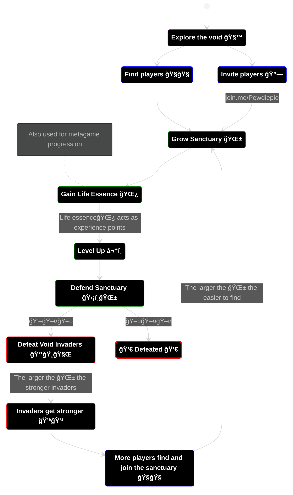

# To Do
* Design Pillars
* FTUE

----

## 🪘 Design Pillars 🪘

These pillars help drive decisions in all aspects of the game design.

### 🗝️ Hyper Accessible
The game should support as many people as possible, on as many devices as possible, in as many situations as possible.

🔓 Simplistic one touch (mobile) or one hand (keyboard/controller) controls.\
🔓 Accessible graphics that are clear and understandable at a glance.\
🔓 Low hardware requirements.\
🔓 Highly device and OS accessible.\
🔓 No segregating of players based on experience, skill, or any other factors.\
🔓 No textual or specific cultural communications.\
🔓 Modes of playing that allow low-skilled players and high-skilled players.\
🔓 No or low download requirements for low bandwidth tolerance.\
🔓 Consideration for individuals with visual and movement impairments.

### 🏘️ Community Engageable
The game should allow communities to engage with it and allows them to strengthen bonds through shared experiences and stories.

👪 Easily shareable via a link.\
👪 Joining a session requires no authentication or personally identifying information. \
👪 Joining immediately places you with the person who invited you. \
👪 Able to join at any point in the session. \
👪 Every extra player is a bonus, never a liability. \
👪 Huge limit on the player count (100+), allowing for large communities. \
👪 Shareable moments that can be distributed in the community. \
👪 Highly co-operatively driven mechanics. \
👪 Gameplay moments that require the players to collaborate and communicate.

### 😄 Casually Enjoyable
The game should be enjoyed in casual settings, it should be stress relieving rather than building, and should be easily engaged with.

🥳 Short up to 15-minute session length. \
🥳 Low learning curve, medium mastery curve. \
🥳 Multi-taskable, allowing people to have split attention while playing. \
🥳 Themes and enemies that are whimsical and light fantasy. \
🥳 No overly complicated or devisive content. \
🥳 Only positive reinforcement, never any punishments or penalties. \
🥳 Allow people to disengage and reingage at a whim with no penalties.

----

## 🏃 Player Motivations 🏃
### 🤝 Cooperation
Players are highly motivated to seek each other out and team up. Players progress faster in groups, are able to help each other out directly using their class abilities. The game is optimally played with a pre-existing community.
### 🏆 Competition
Teams will have statistics of individual performance (damage, healing, ...) displayed at all times which will motivate players to top the team leaderboard. This should lead to shareable moments within communities.
### 🔥 Destruction
The combat will cause destruction to the environment and enemies in an over-the-top fireworks-display comical manner. It should be suprising and enjoyable.
### 💪 Progression
In a 15 minute session players will rapidly progress in their class and be reset at the end of the session. In the metagame players can empower their class by expending earned currency.
### 🔎 Discovery
Players will be able to discover a variety of unique and different environments, class, achievements, and enemies over their sessions.

----

## 🛠️ Main Mechanics 🛠️

### 2D Movement

### Character classes have unique abilities

----

## 🌀 Gameplay Loop 🌀

----

## 🎯 Players' Goal 🎯
The players'🧙 goal is to gain as much life essence🌿 as possible. Life essence is used to upgrade their characters💪 in the metagame. The longer the player is able to defend the sanctuary🌱, the more life essence is gained.

Players are able to last longer by:
1. Finding players🧙 to team up with by inviting them via a link🔗 or finding them in the void, which adds more defenders🛡️ to the sanctuary🌱.
2. Gathering life essence🌿 from the sanctuary efficently by avoiding taking damage💖 from enemies👹.
3. Starting stronger💪 by upgrading class in the metagame using life essence🌿.

----

## 💪 Meta Game Loop 💪

---

## 🧝🧞🧙 Character Classes 🧙🧞🧝

Each class has a unique ability which provides utility and value to a team, so that player's are always happy to see another player join the ranks. 

### 🛡️ Paladin [Medium Skill]
Paladins are able to block incoming projectiles and attacks.

Paladins will position themselves between invaders and team mates, providing a barrier for team mates.

With upgrades, Paladins are able to reflect projectiles at the attacker.

### ❤️‍🩹 Healer [Low Skill]
Healers are able to add a temporary shield to any team mate, absorbing one damage, and heal team mates.

Healers will be mobile, running around and healing those in need, and adding shields to Paladin's. This class is not combat focused and allows those who would find combat stressful a mode of playing.

With upgrades, a healer can stave off death of a team mate by resurrecting them within a small window of their defeat.

### 🏹 Archer [Low Skill]
Archers are able to deal damage in a wide area and are able to push enemies back out of the sanctuary.

Archers will focus on tackling groups of invaders and using their knock-back effect to push larger threatening invaders back out of the sanctuary, allowing for team mates to reposition themselves before fighting it.

With upgrades, archers can use knock backs with more utility including stunning enemies against terrain.

### 🗡️ Rogue [High Skill]
Rogues are able to deal great amounts of damage to single targets and are able to sneak around behind invader lines.

Rogues will focus on tackling large invaders with high health by sneaking up to them and quickly dispatching them and retreating before taking damage by surrounding invaders.

With upgrades, rogues can become more mobile allowing them to be agile to a rapidly changing environment.

### 🔥 Elementalist [Medium Skill]
Elementalists are able absorb environmental effects, such as a fire spreading through the sanctuary which would reduce the life essence gained, and empower team mates with elemental damage.

Elementalists will be on damage control, prioritizing the absorption of elemental effects to mitigate damage to the sanctuary. Once absorbed sufficent elemental essence, they can empower a team mate with it (such as lighting a Paladins sword on fire) allowing that team mate to inflict increased damage.

With upgrades, an elementalist can absorb elemental effects from invaders which results in their attacks not being empowered by elemental effects and thus reducing their impact on the sanctuary.

### 🪢 Controller [High Skill]
Controllers are able to tie invaders up, reducing their ability to attack team mates and the sanctuary.

Controllers will attempt to focus specifically threatening invaders to mitigate their potential for damage. Controllers will work together to tie up large invaders.

With upgrades, a controller can drag a tied up invader back to team mates for disposal before the effect wares off.

### 🦎 Tamer [Low Skill]
Tamers are able to tame void invaders by converting them into sanctuary defenders, which will autonomously defend the sanctuary from invaders.

Tamers will focus on controlled invaders, which will not be able to escape their range. Tamers will work together to tame large invaders.

With upgrades, a tamer can express limited control over tamed invaders - such as directing it to follow and defend the tamer.

### 🌷 Druid [Low Skill]
Druids are able to grow the size of the sanctuary faster than all other classes. Druids are able to grow unique fauna that can help with the defense of the sanctuary, such as barriers and static carnivorous plants which will attack invaders.

Druids will focus on growing the sanctuary, to maximise on life essence production, and setting up defensible areas that the group can defend from more effectively.

With upgrades, a druid can grow more types of fauna that have different utilities.

---

---