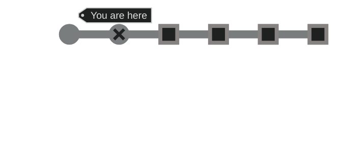
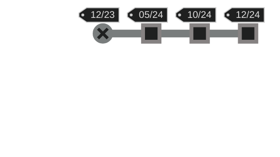
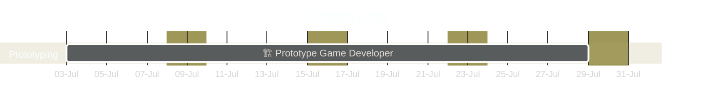
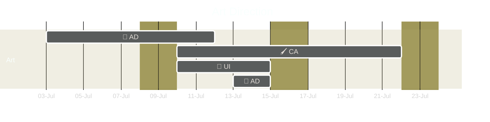
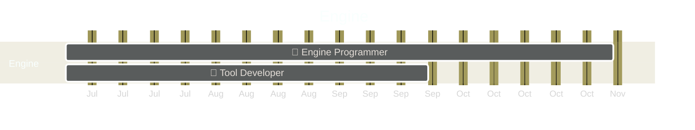
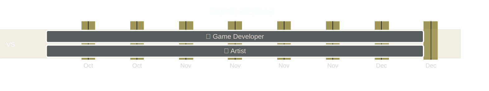

This page defines the plan for developing Void Survivors, including milestones, schedules, and roles.

This document is a WIP and will be iterated upon during the Pre-Production of the game's development.

----

  

    Table of contents
  

  {: .text-delta }
1. TOC
{:toc}

----

## High Level Milestones
These are the milestones that are used during the development of Void Survivors. Void Survivors is a live service game, also known as game-as-a-service, and will continue development post-release.

----

## Current state of the project
Void Survivors has completed the Ideation milestone and is currently in the **Pre-Production** milestone.

----

## Estimated Delivery Schedule
Assuming a July commencement of development, Void Survivors is estimated to be released and in live service operations by the 2024 end of year holiday period.

⛰️ Pre-Production : 22 weeks : December 2023\
⛰️ Alpha          : 20 weeks : May 2024\
⛰️ Beta           : 20 weeks : October 2024\
⛰️ Release        : 12 weeks : December 2024

----

## Team Role Summary

12 roles will directly contribute to development of Void Survivors. Some roles may be performed by the same person, such as Concept Artist and Artist. Most roles will be contracted through the Universe Builders company.

The roles and their estimated full time contribution to the project are:\
🏗️ **Prototype Game Developer** : 12 weeks\
🎨 **Art Director** : 2 weeks\
🖌️ **Concept Artist** : 2 weeks\
🔘 **UI Designer** : 1 week\
💭 **Game Developer** : 60 weeks\
🧮 **Engine Programmer** : 32 weeks\
🔨 **Tool Developer** : 12 weeks\
🚀 **Producer** : 20 weeks\
🎨 **Artist** : 60 weeks\
🎨 **Marketing Materials Artist** : 2 weeks\
🔊 **Sound Designer** : 6 weeks\
🧮 **Backend Programmer** : 14 weeks

Total: 223 full time weeks.

----

## ⛰️ Pre-Production: Milestone Goals

The Pre-Production of Void Survivors requires more effort than an average project within this scope, as Void Survivors will use an in-house developed engine to achieve the design vision and accessibility requirements.

The main goals of the pre-production milestone are:\
🎯 To **de-risk the development** of the game, by producing and testing foundational technology, design decisions, and art direction.\
🎯 To produce a **vertical slice**, ie a game experience at the quality level of the final product for a small segment of the game, demonstrating the core gameplay and gameplay loop.

----

## 📦 Pre-Production: Key Deliverables

### 📦 Gameplay Prototypes
Player experiences will be prototyped in the single-player Unity version to refine mechanics and make design decisions. This is completed in Unity as the in-house engine will not have an editor experience that is optimized for development iteration.

See below for a full list of the gameplay prototypes that will be produced.

### 📦 Mood Board, Color Palette, Concept Art, and refined Art Direction
The Art Director will refine the Art Direction by producing a mood board and color palette. The Art Director will direct the production of original concept art based on the refined Art Direction.

### 📦 Web Game Client Foundation
The web game client foundational technologies will be produced, which will be the player's interface to the game. Core features include Input, 3D Rendering, UI, AI simulation, and Animation.

### 📦 Game Server Foundation
The game server foundational technologies will be produced, which will handle networking between players, applying player actions to the game state, and synchronizing players.

### 📦 Vertical Slice
The vertical slice focuses on the main mechanics, core gameplay loop, and player motivations. It will have final art for the entire experience. It does not include a lot of the secondary mechanics or technical features, to allow the vertical slice to be playtested to ensure the core experience is enjoyable. It will be playtested with friends, family, and local development community.

See below for the features of the Vertical Slice deliverable.

----

## 🪂 Pre-Production: De-risking development
To de-risk development, the following will be completed:\
💭 **Playtesting and iterating on gameplay prototypes** to ensure the intended experiences are being achieved.\
🎨 **Generate and focus group testing concept art** to ensure it meets the art and accessibility targets.\
🧮 **Stress test the web game client** on targeted low-end devices and **server engine** using load tests.\
🎮 **Test the vertical slice** on a range of devices and diverse range of people (skill, motivations).

----

## 📦 Pre-Production: Gameplay Prototypes Deliverable

The player experiences that will be prototyped are:
* As the manager of a community, I want players within my community to be able to play together under the banner of the community, so that new people can discover the community through the game and players within the community need not organize their own teams.
* As a twitch streamer, I want to engage with my audience by inviting them to my team. Whilst playing I want to easily recognizable and feel like the leader of my team, so that my audience can feel like they are interacting with me directly and so I feel important within the group.
* As a small team of close friends, we want to join a larger team and still maintain our small internal group, so that we can have shared communications and experiences with ourselves.
* As two teams, we want to merge together forming a larger team, so that we are able to survive longer.
* As a solo player, I want to be motivated to find a team, so that I don't feel like a viable path is to play solo.
* As a solo player, I want to quickly find a team which I can play a ~15 minute session with, and ideally want to continue playing with after defeat.
* As a highly competitive group of solo players, we want to join larger groups but leave before they are defeated, in order to reach the highest survivability time.

----

## 📦 Pre-Production: Vertical Slice Deliverable

The **vertical slice will** have the following features:\
✅ A full [gameplay loop](design-direction.html#-gameplay-loop-) for a single team.\
✅ 5 minutes sessions, release version will be 15 minutes sessions.\
✅ Up to 3 teams playing in different isolated sessions.\
✅ Up to 20 concurrent players per team.\
✅ Be web based, using in-house developed engine.\
✅ Be playable on all primary platforms (Win, Linux, MacOSX, iPhone, Android).\
✅ Be playable using all primary control schemes (Touch, Keyboard, Gamepad).\
✅ Be playable on all targeted low-end devices.\
✅ Allow inviting players to the team based on a QR code or link.\
✅ A small constrained level.\
✅ Have the final art for the void environment.\
✅ Have atleast 10 unique sanctuary props and final textures.\
✅ Have 4 character classes implemented (Paladin 🛡️, Healer ❤️‍🩹, Archer 🏹, Rogue 🗡️).\
✅ Have 2 abilities for each class gained through gameloop.\
✅ Have the final art for each of the character classes.\
✅ Have 3 basic void creatures implemented, and one mini-boss.\
✅ Have the final art for each void creature and mini-boss.\
✅ Be hosted in a public cloud provider within a single region.\
✅ Provide basic achievement metrics to players, including the amount of time they survived.

The **vertical slice will not** have the following features:\
⭕ Meta game, ie no character progression.\
⭕ User accounts, authentication, or any persistence.\
⭕ No player or technology analytics.\
⭕ No support for solo players looking for a team.\
⭕ No achievements, monetization, character customization.\
⭕ No telegraphed attacks.\
⭕ No stacked abilities.\
⭕ No streamed assets, all assets included in initial download.\
⭕ No competitive statistics.\
⭕ No Audio.

----

## 📅 Pre-Production: Estimated Delivery Timeline
The delivery of the above goals is estimated at **22 weeks from commencement**.\
If started on July 1st, the milestone will be completed by early December.

----

### 👨‍👩‍👧 Pre-Production: Team Roles

The following team members, and their responsibilities, will be active during the Pre-Production milestone.

🏗️ **Prototype Game Developer** : 4 weeks\
  👉 Implement gameplay prototypes in Unity.\
  👉 Orchestrate playtesting of prototypes. \
  👉 Refine design direction based on playtest feedback.

🎨 **Art Director** : 2 weeks\
  👉 Define Color Palette.\
  👉 Define Concept Art deliverables.\
  👉 Provide direction and feedback to Concept Artist and UI Designer.

🖌️ **Concept Artist** : 2 weeks\
  👉 Implement Concept Art.\
  👉 Implement Animation Samples.\
  👉 Implement Character Designs.\
  👉 Refine based on feedback from Art Director.

🔘 **UI Designer** : 1 week\
  👉 Design UI Mockups.

💭 **Game Developer** : 8 weeks\
  👉 Design behaviors for void creatures in vertical slice.\
  👉 Design abilities for characters in vertical slice.\
  👉 Implement gameplay elements in vertical slice.\
  👉 Implement UI in vertical slice.\
  👉 Orchestrate playtesting of vertical slice.\
  👉 Refine design direction based on vertical slice feedback.

🎨 **Artist** : 8 weeks\
  👉 Implement final art assets for vertical slice (characters, void creatures, environments).

🔨 **Tool Developer** : 8 weeks\
  👉 Implement asset pipelines from source assets to deployed versions.\
  👉 Implement CI/CD pipelines for ease of development and deployment.\
  👉 Implement basic editor functionality, such as pausing the simulation and inspecting data.

🧮 **Engine Programmer** : 12 weeks\
  👉 Identify target minimum low-end devices (eg iPhone 7).\
  👉 Implement game client foundation.\
  👉 Implement game server foundation.\
  👉 Deploy game and make accessible for playtests.\
  👉 Stress test client and server technologies.

----

## 👨‍👩‍👧 Pre-Production: Team Members

🏗️ Prototype Game Developer : **To be contracted**.\
🎨 Art Director   : **To be contracted**.\
🖌️ Concept Artist : **To be contracted**.\
🔘 UI Designer    : **To be contracted**.\
💭 Game Developer : James Knight.\
🎨 Artist         : **To be contracted**.\
🔨 Tool Developer : James Knight.\
🧮 Engine Programmer : James Knight.

The prototype game designer can be undertaken by a junior level, as the technology stack is well known and the quality of the code and project need only survive for the usage of playtesting. Publicly available assets will be highly leveraged.

The art director will be a once off consultant, ideally with significant experience in setting an art direction.

The concept artist, UI designer, and artist roles can be fulfilled by one person. If it is hard to find a person with all three skill sets, they can be separated and contracted at different points in the development.

The programming, tool development, and game development responsibilities will be undertaken by James Knight, which allows for an efficient development synergy of the engine, editor, and development frameworks. Future versions of these roles will be open for contractors and the technology will be in a stable and documented state to allow ease of onboarding and development. At this phase there needs to be a lot of decisions around architecture which requires an experience programmer, which James Knight will fulfill.

----

### ⚠️ Pre-Production: Risks & Mitigations ✅
⚠️ **The 'Game Developer' role will be hard or expensive to source**\
The custom game engine uses technologies that are less common for game developers to possess. Specifically, Web based technologies are not common for game developers to have. Further, the use of the C language is infrequently used in games where C# (Unity) and C++ (Unreal Engine) are more common. Further, game developers are generally wary of joining companies with unique tech stacks due to the low transferability of skills to other employers.

✅ Unreal Engine developers would fit better than Unity developers in C programming, as C++ (Unreal) is far closer in language to C than C# (Unity). When hiring, preference those with Unreal or C++ skills.\
✅ The engine leverages numerous libraries that reduce the complexity of C, specifically by providing Data Structures and Algorithms that can be used out of the box.\
✅ The engine is architected in a way that all of the logic touched by Game Developers will be in C, and no knowledge or understanding of Web technologies is required. Specifically shaders are in typical GLSL and all logic is transpiled into WebAssembly and run on the Web without any input required from the developer.\
✅ Developers can be excited by new technologies, as they do not carry the legacy baggage that frustrates developers in the Unity and Unreal ecosystems. This could be a huge selling point when hiring.\
✅ Developers looking to upskill in new technologies would fit well, this could be a selling point when hiring. 

⚠️ **The programmer role is highly specialized and will be hard or expensive to source**\
The programmer role requires a bunch of specialized skills, specifically engine development, multiplayer knowledge, kubernetes expertise, ...

✅ James Knight will be undertaking this role for the duration of the project, and has 10+ years experience in developing such technologies.\
✅ In future milestones, programmer contractors will have access to a more abstracted, stable, and documented technology - allowing for development without the expertise of those specialized skills. 

⚠️ **Art will be too computationally or graphically expensive for target hardware**

✅ As part of the refinement of the art direction the programmer should be included with respect to hypothesising and validating the performance of the art. This should be incorporated to the stress testing of the client. If the art is too expensive, then concessions must be made on the art or the minimum required hardware.

⚠️ **Asset pipelines are inoptimal leading to slow development iteration**
As the custom engine may not be optimal for the artist to integrate their work, test it out in the game engine renderer, and test it with gameplay -- as the tooling may not exist or be immature.

✅ The programmer will be working along side the artist to define and implement appropriate pipelines.\
✅ The artist is able to continue work in isolation of their tool, MagicaVoxel, to implement the models and animations as it has in built support for the Isometric camera that will also be used within the game. Due to the simplistic level design, little consideration is needed with respect to composing models within a complicated scene.

⚠️ **Transitioning the game-genre into multiplayer requires extensive design iterations and testing**\
The Survivors-Like genre is mostly single-player, with only one game in the genre that supports two players. Because this genre has never been combined with MMO it may require a lot of work to get them to mesh together coherently.

✅ To front load this risk, ideally before testing the vertical-slice, there will be a number of prototypes created in Unity to experiment with many of the least refined mechanics of the game.\
✅ Whilst there are no Survivors-Like games, there are numerous games that are in the MMO space that contain similar gameplay mechanics which do work exceptionally well - such as Realm of the Mad God and certain dungeons in World of Warcraft. Taking inspiration from these titles provides a set of tools that is proven to work in this general genre.

⚠️ **James Knight has too many programming responsibilities to deliver the milestone on time**

✅ The Tool Developer 🔨 role can be contracted out without much risk to expense. (See Opportunities below).\
✅ The vertical slice has been defined to allow appropriately distributing programming work to other milestones.\
✅ Contractors can be hired for specific tasks, such as creating the CI/CD pipeline.\
✅ Time estimations include expectations that these roles will be undertaken by one person.

----

## ⭐ Pre-Production: Opportunities

✅ **Web developers can be contracted for tooling 🔨**\
Most game development tool positions requires expertise that generally falls outside a typical game developer's skill set, and are generally less attractive roles because they are supporting development opposed to working on the game directly.

As the engine focuses on a Web based platform deployment, the editor will focus on the Web Browser as the native development tool. This opens up the ability to hire to web developers, of which the market is saturated with Web Developers and the cost of contracting a web developer is significantly lower than a typical Game Tool developer.

Further, the Web has the richest ecosystem of tooling via pre-build packages than any other ecosystem (npm). These tools can be leveraged opposed to developing them directly, reducing the development timeline and increasing the quality of tooling.

✅ **Juniors can be contracted for prototyping**\
James Knight has been teaching Unity developers for 3+ years and has access to a wide network of junior level game developers. 

Due to the technology choices and requirements of the prototype, juniors are able to develop effectively and autonomously.

✅ **Leveraging James Knight's specialization to produce a genre that is under supplied**\
As seen in the [market-research](/market-research), the genres of Void Survivors is under supplied, specifically in the MMO genre.

James Knight has 8+ years working as an engineer, designer, and product manager for MMO game and technology development. This experience is highly leveraged during the development of Void Survivors.

----

## ⛰️ Alpha: Milestone Goals

The Alpha of Void Survivors requires more effort than an average project within this scope, as Void Survivors will use an in-house developed engine to achieve the design vision and accessibility requirements.

The main goals of the Alpha milestone are:\
🎯 To **deliver all major technology components** for the in-house game client, game server, and vital auxiliary services.
🎯 To produce a **horizontal slice**, ie a game experience that includes all main mechanics and the meta-game loop.

**This milestone requires refinement which will be completed by the Producer role post completion of the Pre-Production milestone.**

----

## 📦 Alpha: Key Deliverables

### 📦 Web Game Client Core
The web game client foundational technologies will be produced, which will be the player's interface to the game. Core features include Input, 3D Rendering, UI, AI simulation, and Animation.

### 📦 Game Server Core
The game server foundational technologies will be produced, which will handle networking between players, applying player actions to the game state, and synchronizing players.

### 📦 Vital auxiliary Game Services
Various game services will be used for the horizontal slice to allow for character progression and persistence. Specifically authentication, databases, and analytics will be used. See [technical direction](/technical-direction) for more information.

### 📦 Horizontal Slice
The horizontal slice focuses on delivering a full game experience, ie a game experience that includes all major features of the game including the meta game loop. Parts of the experience will have placeholder elements, including functionality and art. The horizontal slice will also extend on the vertical slice by extending the content and session length at the final release quality.

See below for the features of the Alpha Build deliverable.

----

## 📦 Alpha: Horizontal Slice Deliverable

The **horizontal slice will** have the following features:\
✅ A full [gameplay loop](design-direction.html#-gameplay-loop-) for a single team.\
✅ Audio, music and sound effects.\
✅ 10 minutes sessions, release version will be 15 minutes sessions.\
✅ Up to 10 teams playing in different isolated sessions.\
✅ Up to 50 concurrent players per team.\
✅ Be web based, using in-house developed engine.\
✅ Be playable on all primary platforms (Win, Linux, MacOSX, iPhone, Android).\
✅ Be playable using all primary control schemes (Touch, Keyboard, Gamepad).\
✅ Be playable on all targeted low-end devices.\
✅ Allow inviting players to the team based on a QR code or link.\
✅ A large constrained level.\
✅ Have atleast 20 unique sanctuary props and final textures.\
✅ Have 8 character classes implemented.\
✅ Have 4 abilities for each class gained through gameloop.\
✅ Have the final art for each of the character classes.\
✅ Have 8 basic void creatures implemented, and 3 mini-bosses.\
✅ Have 1 boss with telegraphed attacks implemented.\
✅ Have the final art for each void creature and mini-boss.\
✅ Be hosted in a public cloud provider within 2 unique regions.\
✅ [Meta game loop](/design-direction) and character progression.\
✅ User accounts, authentication, and persistence.\
✅ Basic player analytics.

The **horizontal slice will not** have the following features:\
⭕ No support for solo players looking for a team.\
⭕ No achievements, monetization, character customization.\
⭕ No stacked abilities.\
⭕ No streamed assets, all assets included in initial download.\
⭕ No competitive statistics.

----

## 📅 Alpha: Estimated Delivery Timeline
The delivery of the above goals is estimated at **20 weeks from commencement**. Alpha will begin after the delivery of the Pre-Production milestone.

----

### 👨‍👩‍👧 Alpha: Team Roles

🚀 **Producer** : 8 weeks\
👉 Refining Alpha, Beta, and Release milestones.\
👉 Forming relationships with distribution partners.\
👉 Tracking milestone delivery progress.\
👉 Assigning and tracking reported bugs.\
👉 Progressing financial plan goals.\
👉 Conducting market segmentation and analysis.\
👉 Executing user acquisition and retention strategies.

🔊 **Sound Designer** : 2 weeks\
👉 Developing audio direction.\
👉 Sourcing and developing music and sound effects.

🏗️ **Prototype Game Developer** : 4 weeks\
👉 Implement gameplay prototypes in Unity.\
👉 Orchestrate playtesting of prototypes. \
👉 Refine design direction based on playtest feedback.

💭 **Game Developer** : 20 weeks\
👉 Implement gameplay elements in alpha.\
👉 Implement UI.\
👉 Orchestrate playtesting.\
👉 Refine design direction based on playtest feedback.

🎨 **Artist** : 20 weeks\
👉 Implement final art assets for the Alpha deliverable (characters, void creatures, environments).

🔨 **Tool Developer** : 2 weeks\
👉 Implement tools to increase productivity of developers.

🧮 **Engine Programmer** : 20 weeks\
👉 Implement game client core.\
👉 Implement server client core.

🧮 **Backend Programmer** : 4 weeks\
👉 Implement and integrate auxiliary services.

----

## ⛰️ Beta: Milestone Goals

The main goals of the Beta milestone are:\
🎯 To **complete all major gameplay systems** to a polished degree.\
🎯 To **allow for monetizing** the game through the defined monetization strategies.\
🎯 To **allow for live servicing** the game with infrequent disruption.\
🎯 To **produce all final marketing materials** including icon and cover art.

**This milestone requires refinement which will be completed by the Producer role during the Alpha Milestone.**

----

## 📦 Beta: Key Deliverables

### 📦 Auxiliary Game Services
Various game services will be used for the horizontal slice to allow for character progression and persistence. Specifically authentication, databases, and analytics will be used. See [technical direction](/technical-direction) for more information.

### 📦 Early Access
The horizontal slice focuses on delivering a full game experience, ie a game experience that includes all major features of the game including the meta game loop. Parts of the experience will have placeholder elements, including functionality and art. The horizontal slice will also extend on the vertical slice by extending the content and session length at the final release quality.

See below for the features of the Alpha Build deliverable.

----

## 📦 Beta: Early Access Deliverable

The **horizontal slice will** have the following features:\
✅ Full 15 minute sessions.\
✅ Up to 100 teams playing in different isolated sessions.\
✅ Up to 100 concurrent players per team.\
✅ Be playable on all primary platforms (Win, Linux, MacOSX, iPhone, Android).\
✅ Be playable using all primary control schemes (Touch, Keyboard, Gamepad).\
✅ Be playable on all targeted low-end devices.\
✅ All main gameplay mechanics, including stacked abilities.\
✅ Competitive statistics, including healing and damage.\
✅ An open world that loops on itself.\
✅ All release character classes implemented.\
✅ Have 3 bosses with telegraphed attacks implemented.\
✅ Be hosted in a public cloud provider within 3 unique regions.\
✅ Payment processing and refund processes.\
✅ Detailed player analytics.

The **early access will not** have the following features:\
⭕ No achievements.\
⭕ No streamed assets, all assets included in initial download.

----

## 📅 Beta: Estimated Delivery Timeline
The delivery of the above goals is estimated at **20 weeks from commencement**. Beta will begin after the delivery of the Alpha milestone.

----

### 👨‍👩‍👧 Beta: Team Roles

🚀 **Producer** : 8 weeks\
👉 Refining milestones.\
👉 Negotiating distribution agreements via partners.\
👉 Tracking milestone delivery progress.\
👉 Assigning and tracking reported bugs.\
👉 Progressing financial plan goals.\
👉 Defining refund and customer support policies and mechanisms.\
👉 Executing user acquisition and retention strategies.

🎨 **Marketing Materials Artist** : 2 weeks\
👉 Producing icons.\
👉 Producing splash and cover art.\
👉 Producing early access trailer.

👪 **Community Manager** : 4 weeks\
👉 Moderating games' discord channel.\
👉 Organizing events including playtests.\
👉 Engaging with communities defined in [marketing plan](/marketing-and-release-plan).

🔊 **Sound Designer** : 2 weeks\
👉 Sourcing and developing music and sound effects.

💭 **Game Developer** : 20 weeks\
👉 Implement gameplay elements in alpha.\
👉 Implement UI.\
👉 Orchestrate playtesting.

🎨 **Artist** : 20 weeks\
👉 Implement final art assets for the Beta deliverable (characters, void creatures, environments).

🔨 **Tool Developer** : 2 weeks\
👉 Implement tools to increase productivity of developers.

🧮 **Backend Programmer** : 6 weeks\
👉 Implement and integrate auxiliary services.

----

## ⛰️ Release: Milestone Goals

The main goals of the Release milestone are:\
🎯 To **polish all game systems and content**.\
🎯 To **optimize performance** to reduce operational expenditure.\
🎯 To **validate accessibility** goals are met.\
🎯 To **achieve marketing strategies** including engaging community managers, distributors, and Twitch streamers.

**This milestone requires refinement which will be completed by the Producer role during the Alpha Milestone.**

----

## 📅 Release: Estimated Delivery Timeline
The delivery of the above goals is estimated at **12 weeks from commencement**. Release will begin after the delivery of the Beta milestone.

----

### 👨‍👩‍👧 Release: Team Roles

🚀 **Producer** : 4 weeks\
👉 Negotiating distribution agreements via partners.\
👉 Tracking milestone delivery progress.\
👉 Assigning and tracking reported bugs.\
👉 Progressing financial plan goals.\
👉 Executing user acquisition and retention strategies.

👪 **Community Manager** : 6 weeks\
👉 Moderating games' discord channel.\
👉 Organizing events including playtests.\
👉 Engaging with communities defined in [marketing plan](/marketing-and-release-plan).

🔊 **Sound Designer** : 2 weeks\
👉 Sourcing and developing music and sound effects.

💭 **Game Developer** : 12 weeks\
👉 Implement gameplay elements in alpha.\
👉 Implement UI.\
👉 Orchestrate playtesting.

🎨 **Artist** : Full Time\
👉 Implement final art assets for the Release deliverable (characters, void creatures, environments).

🧮 **Backend Programmer** : 4 weeks\
👉 Implement and integrate auxiliary services.