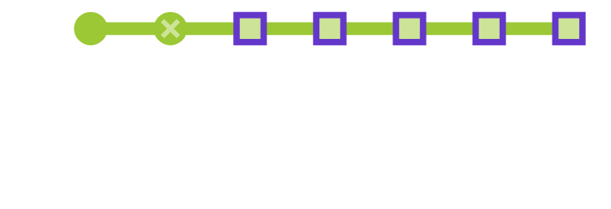

This page defines the plan for developing Void Survivors, including milestones, schedules, and roles.

This document is a WIP and will be iterated upon during during the Pre-Production of the game's development.

----

  

    Table of contents
  

  {: .text-delta }
1. TOC
{:toc}

----

## State of the project

## High Level Milestones
These are the milestones that are identified during the development plan.

## Pre-Production Milestones

### 🎯 Vertical Slice

* Prototypes
  As a solo player, I want to live beyond my team ...

* Key concept art generated

* Content pipelines defined and integrated

* Identify exact device targets eg iPhone 8

* Access consultants

## Alpha Milestones

* GDPR compliance
* Bug reporting
* Community Manager
* Budding discord community
* Devlogs
* Testing with vision impairments, movement impairments

## Beta Milestones

* Refunds
* Refund policies
* Purchasing

## Release Milestones

## Challenges and Risk Analysis

----

# To Do
* schedule
* milestones
* roadmap
* showing clear tasks and milestones for the pre-production stage
* showing outcomes from the stage and next steps to take the game to release
/ completion
* what roles are needed and when
* HL thematic overview of months of work remaining
* How is that broken up, roles required, hours allocated

* Timeline

* Risks, acknowledgement, mitigations

* Risk: Gameplay enjoyment
* Risk: Different scales of players
* Risk: C
* Risk: Complex technology
