This page defines the plan for developing Void Survivors, including milestones, schedules, and roles.

This document is a WIP and will be iterated upon during during the Pre-Production of the game's development.

----

  

    Table of contents
  

  {: .text-delta }
1. TOC
{:toc}

----

* Key deliverables
* Audio
* How many people will be hired

## High Level Milestones
These are the milestones that are identified during the development plan.

## Current state of the project
Void Survivors has completed the Ideation milestone and is currently in the **Pre-Production** milestone.

----

## Pre-Production Milestone
The main goals of the pre-production milestone are:\
🎯 To **de-risk the development** of the game, by producing and testing key technology, design decisions, and art direction.\
🎯 To produce a **vertical slice**, ie a game experience at the quality level of the final product for a small segment of the game, demonstrating the core gameplay and gameplay loop.

### De-risking development

To de-risk development, the following will be completed:\
💭 **Prototype player experiences** in the single-player Unity version to refine mechanics.\
🎨 **Generate and test concept art** to ensure it meets the art and accessibily targets.\
🧮 **Stress test the client technology** on low-end devices and **server technology** using load targets.\
🎮 **Test the vertical slice** on a range of devices and diverse range of people (skill, motivations).

Specifically the player experiences that will be prototyped are:
* As the manager of a community, I want players within my community to be able to play together under the banner of the community, so that new people can discover the community through the game and players within the community need not organize their own teams.
* As a twitch streamer, I want to engage with my audience by inviting them to my team. Whilst playing I want to easily recognizable and feel like the leader of my team, so that my audience can feel like they are interacting with me directly and so I feel important within the group.
* As a small team of close friends, we want to join a larger team and still maintain our small internal group, so that we can have shared communications and experiences with ourselves.
* As two teams, we want to merge together forming a larger team, so that we are able to survive longer.
* As a solo player, I want to be motivated to find a team, so that I don't feel like a viable path is to play solo.
* As a solo player, I want to quickly find a team which I can play a ~15 minute session with, and ideally want to continue playing with after defeat.
* As a highly competitive group of solo players, we want to join larger groups but leave before they are defeated, in order to reach the highest survivability time.

### Vertical Slice

The vertical slice focuses on the main mechanics, core gameplay loop, and player motivations. It will have final art for the entire experience. It does not include a lot of the secondary mechanics or technical features, to allow the vertical slice to be playtested to ensure the core experience is enjoyable. It will be playtested with friends, family, and local development community.

The **vertical slice will** have the following features:\
✅ A full [gameplay loop](http://localhost:4000/void-survivors/design-direction.html#-gameplay-loop-) for a single team.\
✅ Up to 3 teams playing in different isolated sessions.\
✅ Up to 20 concurrent players per team.\
✅ Be web based, using in-house developed engine.\
✅ Be playable on all primary platforms (Win, Linux, MacOSX, iPhone, Android).\
✅ Be playable using all primary control schemes (Touch, Keyboard, Gamepad).\
✅ Be playable on all targetted low-end devices.\
✅ Allow inviting players to the team based on a QR code or link.\
✅ A small constrained level.\
✅ Have the final art for the void environment.\
✅ Have atleast 10 unique sanctuary props and final textures.\
✅ Have 4 character classes implemented (Paladin 🛡️, Healer ❤️‍🩹, Archer 🏹, Rogue 🗡️).\
✅ Have 2 abilities for each class gained through gameloop.\
✅ Have the final art for each of the character classes.\
✅ Have 3 basic void creatures implemented, and one mini-boss.\
✅ Have the final art for each void creature and mini-boss.\
✅ Be hosted in a public cloud provider within a single region.\
✅ Provide the team with amount of time they lasted.

The **vertical slice will not** have the following features:\
⭕ Meta game, ie no character progression.\
⭕ User accounts, authentication, or any persistence.\
⭕ No player or technology analytics.\
⭕ No support for solo players looking for a team.\
⭕ No achievements, monetization, character customization.\
⭕ No telegraphed attacks.\
⭕ No stacked abilities.\
⭕ No streamed assets, all assets included in initial download.\
⭕ No competitive statistics.

### 📅 Estimated Delivery Timeline
The delivery of the above goals is estimated at **22 weeks from commencement**.\
If started on July 1st, the milestone will be completed by early December.

### 👨‍👩‍👧 Team Roles

The following team members, and their responsibilities, will be active during the Pre-Production milestone.

🏗️ **Prototype Game Developer** : 4 weeks\
  👉 Implement gameplay prototypes in Unity.\
  👉 Orchestrate playtesting of prototypes. \
  👉 Refine design direction based on playtest feedback.

🎨 **Art Director** : 2 weeks\
  👉 Define Color Pallette.\
  👉 Define Concept Art deliverables.\
  👉 Provide direction and feedback to Concept Artist and UI Designer.

🖌️ **Concept Artist** : 2 weeks\
  👉 Implement Concept Art.\
  👉 Implement Animation Samples.\
  👉 Implement Character Designs.\
  👉 Refine based on feedback from Art Director.

🔘 **UI Designer** : 1 week\
  👉 Design UI Mockups.

💭 **Game Developer** : 8 weeks\
  👉 Design behaviors for void creatures in vertical slice.\
  👉 Design abilities for characters in vertical slice.\
  👉 Implement gameplay elements in vertical slice.\
  👉 Implement UI in vertical slice.\
  👉 Orchestrate playtesting of vertical slice.\
  👉 Refine design direction based on vertical slice feedback.

🎨 **Artist** : 8 weeks\
  👉 Implement final art assets for vertical slice (characters, void creatures, environments).

🔨 **Tool Developer** : 8 weeks\
  👉 Implement asset pipelines from source assets to deployed versions.\
  👉 Implement CI/CD pipelines for ease of development and deployment.\
  👉 Implement basic editor functionality, such as pausing the simulation and inspecting data.

🧮 **Engine Programmer** : 12 weeks\
  👉 Identify target minimum low-end devices (eg iPhone 7).\
  👉 Implement client web game engine.\
  👉 Implement game server.\
  👉 Deploy game and make accessible for playtests.\
  👉 Stress test client and server technologies.

```mermaid
%%{init: {'theme':'dark'}}%%

gantt
    dateFormat  DD-MM-YYYY
    title Art Direction
    axisFormat %d-%b
    excludes weekends

    section Art
    🎨 AD : 03-07-2023, 7d
    🖌️ CA : 10-07-2023, 10d
    🔘 UI : 10-07-2023, 5d
    🎨 AD : 13-07-2023, 2d  
```

```mermaid
%%{init: {'theme':'dark'}}%%

gantt
    dateFormat  DD-MM-YYYY
    title Vertical Slice
    axisFormat %b
    excludes weekends

    section VS
    💭 Game Developer : 16-10-2023, 40d
    🎨 Artist : 16-10-2023, 40d
```

### 👨‍👩‍👧 Team Members

🏗️ Prototype Game Developer : **To be contracted**.\
🎨 Art Director   : **To be contracted**.\
🖌️ Concept Artist : **To be contracted**.\
🔘 UI Designer    : **To be contracted**.\
💭 Game Developer : James Knight.\
🎨 Artist         : **To be contracted**.\
🔨 Tool Developer : James Knight.\
🧮 Engine Programmer : James Knight.

The prototype game designer can be undertaken by a junior level, as the technology stack is well known and the quality of the code and project need only survive for the usage of playtesting -- with no hardware requirements.

The art director should be a once off consultant, ideally with significant experience in setting an art direction.

The concept artist, ui designer, and artist roles can be fulfilled by one person. If it is hard to find a person with all three skill sets, they can be seperated and contracted at different points in the development.

The programming, tool development, and game development responsibilities will be undertaken by James Knight, which allows for an efficent development synergy of the engine, editor, and development frameworks. Future versions of these roles will be open for contractors and the technology will be in a stable and documented state to allow ease of onboarding and development. At this phase there needs to be a lot of decisions around architecture which requires an experience programmer, which James Knight will fulfill.

### ⚠️ Risks & Mitigations ✅
⚠️ **The 'Game Developer' role will be hard or expensive to source**\
The custom game engine uses technologies that are less common for game developers to possess. Specifically, Web based technologies are not common for game developers to have. Further, the use of the C language is infrequently used in games where C# (Unity) and C++ (Unreal Engine) are more common. Further, game developers are generally wary of joining companies with unique tech stacks due to the low transferability of skills to other employers.

✅ Unreal Engine developers would fit better than Unity developers in C programming, as C++ (Unreal) is far closer in language to C than C# (Unity). When hiring, preference those with Unreal or C++ skills.\
✅ The engine leverages numerous libraries that reduce the complexity of C, specifically by providing Data Structures and Algorithms that can be used out of the box.\
✅ The engine is architected in a way that all of the logic touched by Game Developers will be in C, and no knowledge or understanding of Web technologies is required. Specifically shaders are in typical GLSL and all logic is transpiled into WebAssembly and run on the Web without any input required from the developer.\
✅ Developers can be excited by new technologies, as they do not carry the legacy baggage that frustrates developers in the Unity and Unreal ecosystems. This could be a huge selling point when hiring.\
✅ Developers looking to upskill in new technologies would fit well, this could be a selling point when hiring. 

⚠️ **The programmer role is highly specialized and will be hard or expensive to source**\
The programmer role requires a bunch of specialized skills, specifically engine development, multiplayer knowledge, kubernetes expertise, ...

✅ James Knight will be undertaking this role for the duration of the project, and has 10+ years experience in developing such technologies.\
✅ In future milestones, programmer contractors will have access to a more abstracted, stable, and documented technology - allowing for development without the expertise of those specialized skills. 

⚠️ **Art will be too computationally or graphically expensive for target hardware**

✅ As part of the refinement of the art direction the programmer should be included with respect to hypothesising and validating the performance of the art. This should be incorporated to the stress testing of the client. If the art is too expensive, then concessions must be made on the art or the minimum required hardware.

⚠️ **Asset pipelines are inoptimal leading to slow development iteration**
As the custom engine may not be optimal for the artist to integrate their work, test it out in the game engine renderer, and test it with gameplay -- as the tooling may not exist or be immature.

✅ The programmer will be working along side the artist to define and implement appropriate pipelines.\
✅ The artist is able to continue work in isolation of their tool, MagicaVoxel, to implement the models and animations as it has in built support for the Isometric camera that will also be used within the game. Due to the simplistic level design, little consideration is needed with respect to composing models within a complicated scene.

⚠️ **Transitioning the game-genre into multiplayer requires extensive design iterations and testing**\
The Survivors-Like genre is mostly single-player, with only one game in the genre that supports two players. Because this genre has never been combined with MMO it may require a lot of work to get them to mesh together coherently.

✅ To front load this risk, ideally before testing the vertical-slice, there will be a number of prototypes created in Unity to experiment with many of the least refined mechanics of the game.\
✅ Whilst there are no Survivors-Like games, there are numerous games that are in the MMO space that contain similar gameplay mechanics which do work exceptionally well - such as Realm of the Mad God and certain dungeons in World of Warcraft. Taking inspiration from these titles provides a set of tools that is proven to work in this general genre.

⚠️ **James Knight has too many programming responsibilities to deliver the milestone on time**

✅ The Tool Developer 🔨 role can be contracted out without much risk to expense. (See Opportunities below).\
✅ The vertical slice has been defined to allow appropriately distributing programming work to other milestones.\
✅ Contractors can be hired for specific tasks, such as creating the CI/CD pipeline.\
✅ Time estimations include expectations that these roles will be undertaken by one person.

### Opportunities

✅ **Web developers can be contracted for tooling 🔨**\
Most game development tool positions requires expertise that generally falls outside a typical game developer's skill set, and are generally less attractive roles because they are supporting development opposed to working on the game directly.

As the engine focuses on a Web based platform deployment, the editor will focus on the Web Browser as the native development tool. This opens up the ability to hire to web developers, of which the market is saturated with Web Developers and the cost of contracting a web developer is significantly lower than a typical Game Tool developer.

Further, the Web has the richest ecosystem of tooling via pre-build packages than any other ecosystem (npm). These tools can be leveraged opposed to developing them directly, reducing the development timeline and increasing the quality of tooling.

✅ **Juniors can be contracted for prototyping**\
James Knight has been teaching Unity developers for 3+ years and has access to a wide network of junior level game developers. 

Due to the technology choices and requirements of the prototype, juniors are able to develop effectively and autonomously.

----

## Alpha Milestone
The main goals of the alpha milestone are:
🎯 community manager
🎯

### 👨‍👩‍👧 Team Roles
* Producer

* GDPR compliance
* Bug reporting
* Community Manager
* Budding discord community
* Devlogs
* Testing with vision impairments, movement impairments

----

## Beta Milestone
The main goals of the beta milestone are:
🎯 Professional icon and cover art
🎯 Trailer
🎯 Sponsor one twitch 

### 👨‍👩‍👧 Team Roles

* Refunds
* Refund policies
* Purchasing
* Behavioral Segmentation Analytics
* Geographic Segmentation Analytics

----

## Release Milestone
The main goals of the release milestone are:
🎯
🎯

### 👨‍👩‍👧 Team Roles
