  

    Table of contents
  

  {: .text-delta }
1. TOC
{:toc}

----

## High Level Milestones
These are the milestones that are used during the development of Void Survivors. Void Survivors is a live service game, also known as game-as-a-service, and will continue development post-release.

```mermaid
%%{init: {'theme':'dark', 'gitGraph': {'showBranches': false}, 'themeVariables': {
              'commitLabelColor': '#FFFFFF',
              'commitLabelBackground': '#00000000',
              'commitLabelFontSize': '16px'
  } }}%%

gitGraph
  commit id: "⛰️ Ideation & Direction" type:NORMAL
  commit id: "⛰️ Single Player Basic Prototype" type:NORMAL
  commit id: "⛰️ Multiplayer Prototype" type:REVERSE tag: "You are here"
  commit id: "⛰️ Closed Alpha" type:HIGHLIGHT
  commit id: "⛰️ Early-Access" type:HIGHLIGHT
  commit id: "⛰️ Release" type:HIGHLIGHT
  commit id: "⛰️ Live Service" type:HIGHLIGHT
```

----

## Current state of the project
Void Survivors has completed the **Ideation & Direction** milestone and the **Single Player Basic Prototype** milestone and is currently seeking funding to allow for creation of a **Multiplayer Prototype**.

----

## Project Advancement Strategy
At the completion of the **Multiplayer Prototype** milestone, the next goal will be to seek funding for the completion of the project, or the next milestone of **Closed Alpha**.

Ideally product market fit will have been validated in **Multiplayer Prototype** milestone without many major changes or requiring a pivot. If that is not the case, then the **Closed Alpha** milestone will be re-estimated with a new delivery schedule to account for those changes.

----

## Delivery Schedule

⛰️ Ideation & Direction          : Delivered\
⛰️ Single Player Basic Prototype : Delivered\
⛰️ Multiplayer Prototype         : **8 months**\
⛰️ Closed Alpha                  : **3 months**\
⛰️ Early-Access                  : **3 months**\
⛰️ Release                       : **3 months**

----

## Multiplayer Prototype Milestone

**Goals of the milestone**:\
🎯 To de-risk the development of the game, by producing and testing foundational technology, design decisions, and art direction.\
🎯 To produce a multiplayer gameplay prototype, a game experience at the quality level of the final product for a small segment of the game, demonstrating the core gameplay and gameplay loop.\
🎯 To prove product market fit with target market.

**Metrics for success**:\
⭐ At-least 5 streamers have playtested the prototype with their live audience of over 100 total players.\
⭐ At-least 3 existing discord gaming groups have playtested the game with at least 5 people per playtest.\
⭐ All streamers provided feedback that they would play with their audience again.\
⭐ A majority of streamers provided feedback that they would play with their audience on a frequent basis.\
⭐ A majority of playtesters provided feedback that they would play again with that group.\
⭐ A majority of playtesters provided feedback that they would play again with a different group (if they know of one).

**Features delivered in this milestone**:\
✅ 3 unique classes.\
✅ Support for 25 players concurrent per team.\
✅ Loss condition.\
✅ Basic analytics.\
✅ Cooperative mechanics.\
✅ Ability unlocks.\
✅ Up to 3 teams playing in different isolated sessions.\
✅ Be web based, using in-house developed engine.\
✅ Be playable on all primary platforms (Win, Linux, MacOSX, iPhone, Android).\
✅ Be playable using all primary control schemes (Touch, Keyboard, Gamepad).\
✅ Be playable on all targeted low-end devices.\
✅ Allow inviting players to the team based on a QR code or link.\
✅ A small constrained level.\
✅ Have the final art for the void environment.\
✅ Have atleast 10 unique sanctuary props and final textures.\
✅ Have 3 character classes implemented (Paladin 🛡️, Healer ❤️‍🩹, Archer 🏹).\
✅ Have 2 abilities for each class gained through gameloop.\
✅ Have the final art for each of the character classes.\
✅ Have 3 basic void creatures implemented, and one mini-boss.\
✅ Have the final art for each void creature and mini-boss.\
✅ Be hosted in a public cloud provider within a single region.\
✅ Provide basic achievement metrics to players, including the amount of time they survived.

**Some features not delivered in this milestone**:\
📅 Account Persistence\
📅 Monetization\
📅 Character customization\
📅 Meta game, ie no character progression.\
📅 User accounts, authentication, or any persistence.\
📅 No player or technology analytics.\
📅 No support for solo players looking for a team.\
📅 No matchmaking, teams looking for teams.\
📅 No achievements, monetization, character customization.\
📅 No streamed assets, all assets included in initial download.\
📅 No competitive statistics.

**Sub-milestones**:\
⛰️ <u>Technical Proof of Concept</u>\
This milestone is focused on delivering key game engine technologies, content delivery pipelines, deployment workflows and selecting asset generation tooling. Existing technologies will be leveraged where possible and will be integrated into the engine. Very few systems will be implemented from scratch.

Upon the completion of this milestone the game will be able to be populated with gameplay systems and assets.

Estimated Development Time: 2 months.

⛰️ <u>Foundational Gameplay Systems</u>\
This milestone is focused on delivering the foundational gameplay systems that will be required for the game, such as movement, physics, abilities, player classes, pathfinding, wave spawning, lose condition, and upgrading systems.

Upon the completion of this milestone the game will have the systems required for expressive gameplay to be implemented, tested, and iterated upon.

Estimated Development Time: 3 months.

⛰️ <u>Multiplayer Gameplay</u>\
This milestone is focused on designing, implementing, testing, and iterating upon multiplayer gameplay. There are a lot of design challenges and potentials that will be considered in the generation of the gameplay. Further, the Art Direction will have been fully defined and final hero assets will be in the game.

Upon the completion of this milestone the game will be a 5 minute experience that streamers can play with their audience, with a full game loop and all main mechanics function.

Estimated Development Time: 3 months.

⛰️ <u>Product Market Fit Validation</u>\
This milestone is focused on testing the multiplayer gameplay with streamers and their audience, split testing, and gather feedback from playtesters.

Upon the completion of this milestone the game will be proven with the target market, and a list of game changes driven by play tester feedback will have been generated.

If the game is unsuccessful in proving product market fit then a plan of how to pivot the game to successfully target the target market will be created.

Estimated Development Time: 1 month.

----
### ⛰️ Technical Proof of Concept
**Estimated Development Timeline:**\
3 months.

**Roles Involved:**\
🧮 Engine Programmer

**Main Deliverables:**\
📦 Voxel rendering engine.\
📦 Input system.\
📦 Audio system (music and sound effects).\
📦 Networking system (WebSockets and WebRTC).\
📦 Basic collision detection system.\
📦 Math framework (using glMatrix).\
📦 Animation system.\
📦 Profiling & debugging systems.\
📦 Particle system.\
📦 Gameloop and timing.\
📦 Asset loading and management.\
📦 UI integration (using HTML5 as UI).\
📦 AI framework (State machine).\
📦 Event system (reacting to events).\
📦 Deploying to Web.\
📦 Loading voxel models into engine.\
📦 Loading palettes into engine.\
📦 Loading entity definitions into engine.\
📦 Loading audio into engine.\
📦 Chosen voxel modelling toolset.\
📦 Chosen animation toolset.\
📦 Chosen texturing toolset.\
📦 Chosen game logic generation toolset.

### ⛰️ Fundamental Gameplay Systems

**Estimated Development Timeline:**\
2 months.

**Roles Involved:**\
🧮 Engine Programmer.\
👾 Game Programmer.

**Main Deliverables:**\
📦 Movement system.\
📦 Basic physics (acceleration, velocity, forces).\
📦 Player classes (paladin, healer, archer).\
📦 Abilities, tied to classes.\
📦 Pathfinding, for invaders.\
📦 Health, damage systems.\
📦 Wave spawning systems, for invaders.\
📦 Lose condition system, determining when loss happens.\
📦 Upgrading systems, allow mutating data in abilities or classes.\
📦 State machine.

### ⛰️ Multiplayer Gameplay

**Estimated Development Timeline:**\
2 months.

**Roles Involved:**\
🎲 Game Designer.\
👾 Game Programmer.\
🎨 Artist.\
🔊 Sound Designer.

**Main Deliverables:**\
📦 Art Direction.\
📦 Key art pieces at release quality in game.\
📦 5 minutes of gameplay with full game loop.

**Design Challenges**\
The main design challenge is to translate the tropes, game loop, and main mechanics of the ‘survivors’ genre into a compelling massively-multiplayer experience that works well in a streamer and live audience setting.

Main Challenges:
* How to scale the difficulty to support groups as small as 5 players and as large as 100 players and still achieve a ~5 minute session length?
* How to make players feel impactful in large groups? 
* How to allow players to be recognized and stand out from the pack?
* How to allow players to compete in a friendly way without motivating conflict or toxicity? 
* How to only allow cooperative beneficial interactions which still feel meaningful for players to perform?
* How to allow players to communicate and collaborate in meaningful ways without allowing for exclusion or discrimination?
* How to allow the streamer to remain the center of attention in a large groups of players?
* How to allow non-playing viewers to engage with the game? (e.g. spawning of invaders, providing buffs).

The design should not deviate too far from the tropes of the genre, as the gameplay should be immediately recognizable and accessible to viewers.

**Development Challenges**\
The main development challenge is to provide a highly accessible gameplay experience whilst being able to continue watching and engaging with the streamer.

Main Challenges:
* Support for mobile and desktop devices.
* Support for low powered devices.
* Support for small screens (splitting screen between streamer and game).
* Low download size for streaming.
* No installation required.

### ⛰️ Product Market Fit Validation

**Estimated Development Timeline:**\
1 month.

**Roles Involved:**\
🎲 Game Designer.

**Main Deliverables:**\
📦 Product market fit proof.\
📦 Playtester feedback.\
📦 Split testing feedback.\
📦 List of changes based on feedback.

**Product Market Fit Validation:**\
A valuable resource to validate I have is:\
✅ Access to professional and hobbyist streamers through the MetaHSE organization, which I volunteer at.\
✅ Access to student and alumni streamers in the Torrens University esports and streaming communities, which I help organize events for.

I’ve communicated the Void Survivors concept to both groups and they are excited and willing to validate it with their live audiences.

Specifically I intend to:\
✅ Have streamers play Void Survivors live on stream.\
✅ Have streamers invite their audience to play for a short session. (~5 minutes)\
✅ After the short session, have the streamer ask their audience if they would want to play together when the game is released.\
✅ Have streamers provide direct feedback to me, with what they’d change about the game.

