

  

    Table of contents
  

  {: .text-delta }
1. TOC
{:toc}

----

## Steam Genre Supply Demand

### Void Survivors
Main Genre: MMO\
Sub-Genres: Action RPG, Roguelite, Survivors-Like(Bullet-Heaven, Swarm-Defense).

See [Design Direction](design-direction) for more info.

### MMO

The main genre of Void Survivors is MMO.

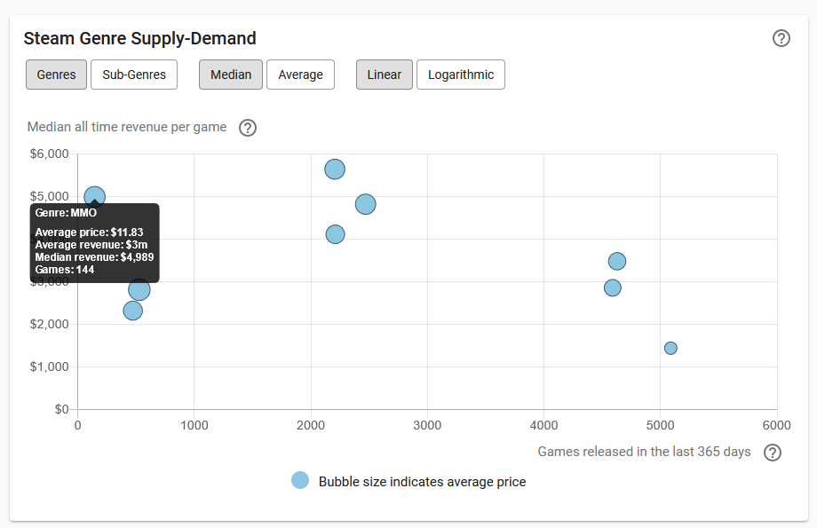\
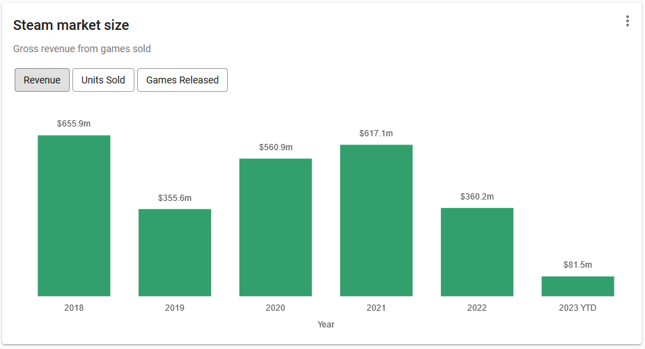\
[Source: VG Insights](https://vginsights.com/genre-analytics)

MMO is the most undersupplied genre on Steam of all genres categorized by VGI, which is to say that it has the fewest title releases of any genre.

MMO's also have the highest average revenue on Steam (last 365 days):
1. MMO: $3m
2. RPG: $1.4m
3. Action: $1.3m

MMO's have a significant market size of ~$500m USD on average in the past 5 years.

### Action + RPG

One of the sub-genres of Void Survivors is Action RPG.

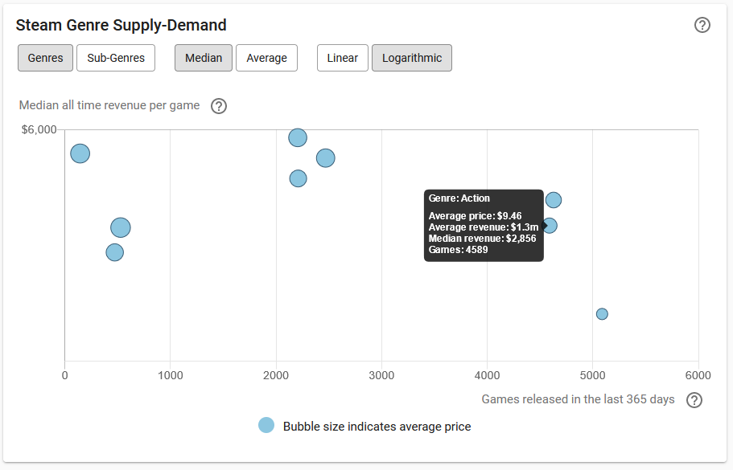\
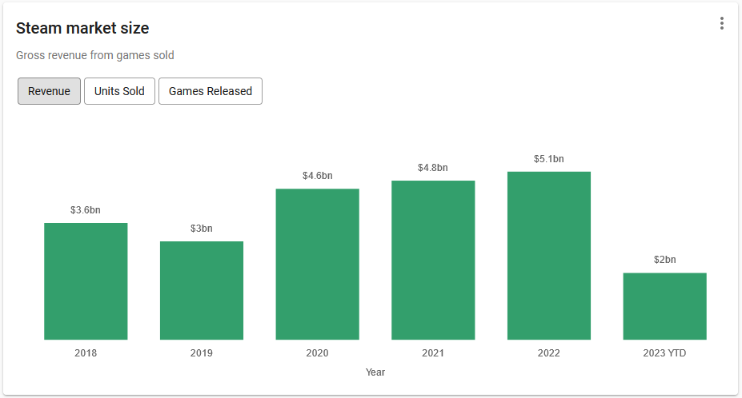

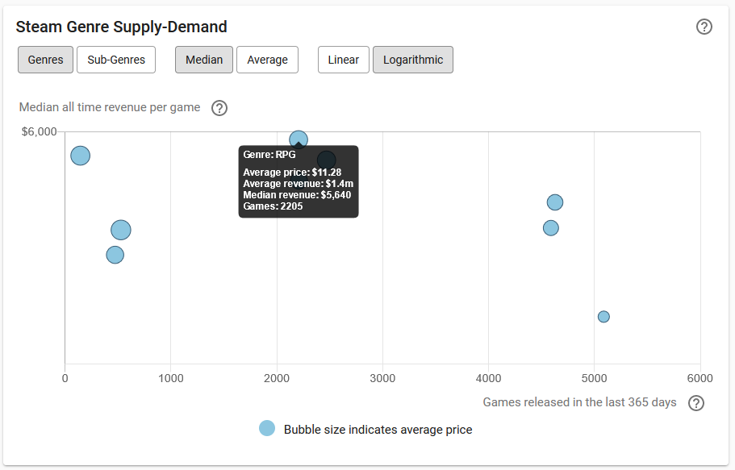
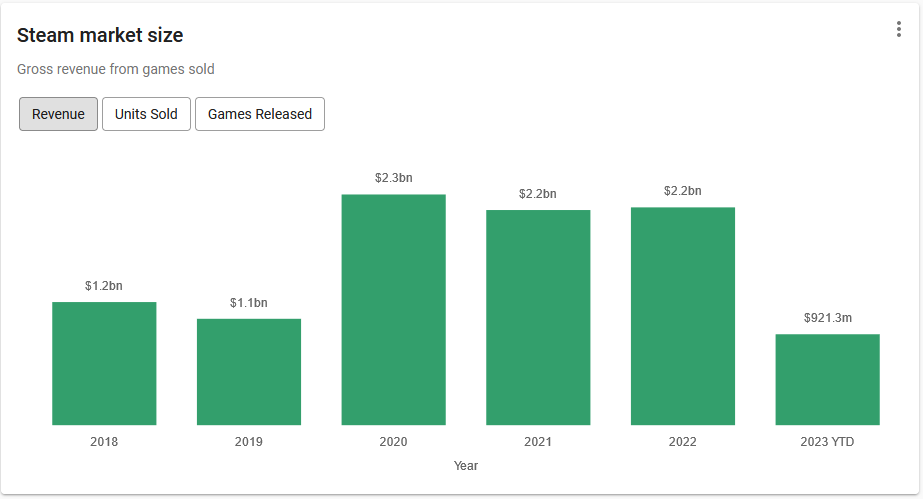
[Source: VG Insights](https://vginsights.com/genre-analytics)

RPG and Action, two of the primary sub-genres of Void Survivors, are also in the top 3 of average revenue on Steam.

However Action games are the 3rd (of 9) most supplied genre on Steam, making it a highly congested market, and RPG are the 6th most supplied.

### Survivors-Like

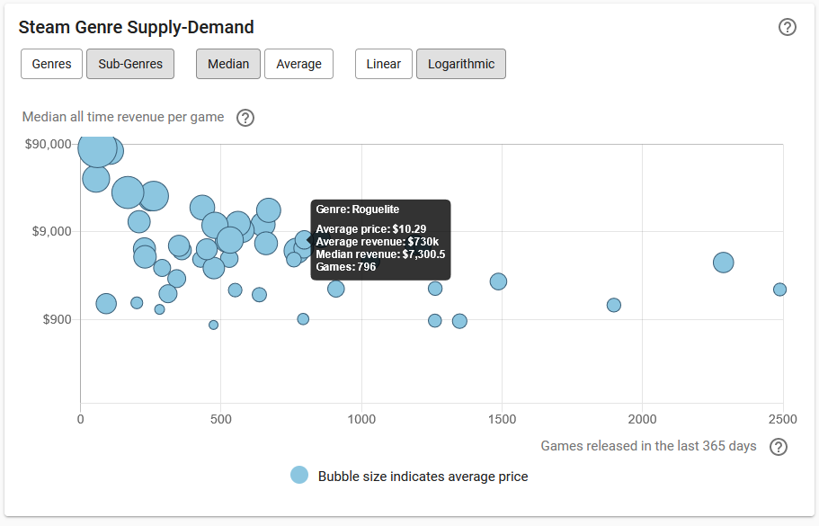
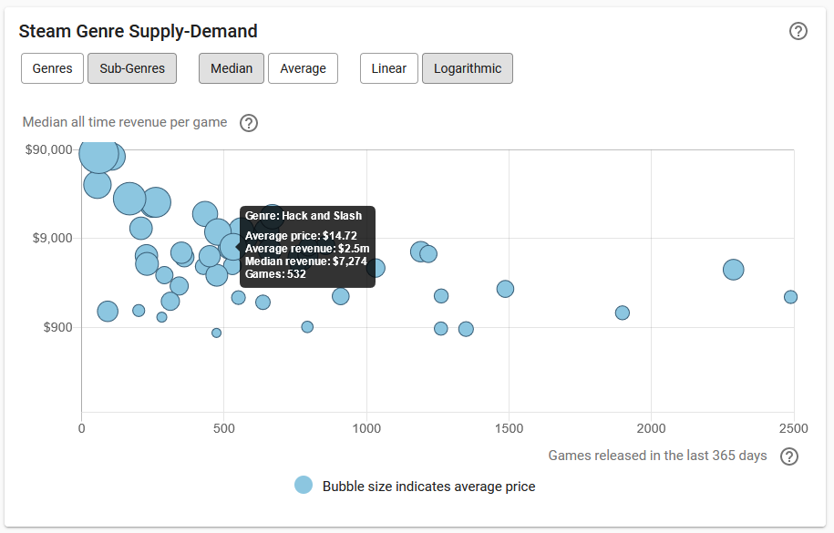
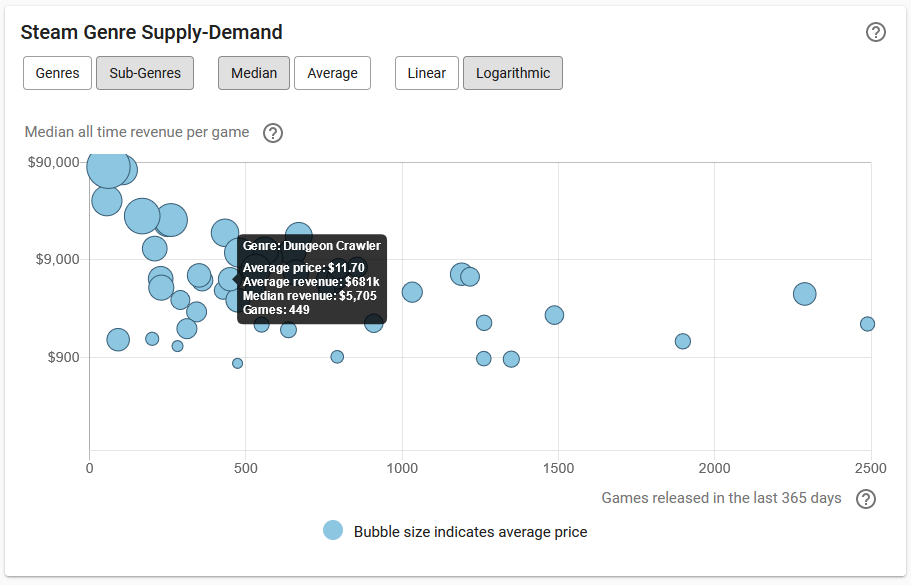\
[Source: VG Insights](https://vginsights.com/genre-analytics)

The roguelite subgenre is slightly undersupplied and the two subgenres most similar to Bullet-Heaven and Swarm-Defense, Dungeon Crawler and Hack and Slash, are both somewhat undersupplied. Both Bullet-Heaven and Swarm-Defense subgenres are not tracked by VGI.

All four sub-genres sit in the top 30% of average revenue.

## Steam Genre Supply Demand Analysis

There is a great opportunity for supplying games in the MMO genre, which is the main genre of Void Survivors. It is paired with three sub-genres which are undersupplied (Roguelite, Bullet-Heaven, Swarm-Defense), and one sub-genre that is oversupplied (Action).

There is concern with action games being the third most popular genre on Steam as it may be hard to differentiate in that competitive market, especially when a lot of the game-loop of Void Survivors revolves around action. Action however is the largest market size of all the genres of Void Survivors meaning the demand is high for the genre.

Hack and slash, dungeon crawlers, and roguelikes all have a low average price compared to other genres (~$11.50). This may be an advantage as Void Survivors is a free-to-play game and players of these genres expect to pay relatively low for those genres, but may be an indicator that players are willing to spend less and convert less into paying players.

----

## Similar Games (Survivors-Like)

Void Survivors is a Survivors-Like game, a new hybrid genre of Bullet-Heaven and Swarm-Defense, inspired by the 2022 indie megahit 'Vampire Survivors' and the dozens of Survivors-Like games that have been released since.

The following games are releases in the Survivors-Like genre.

### Vampire Survivors

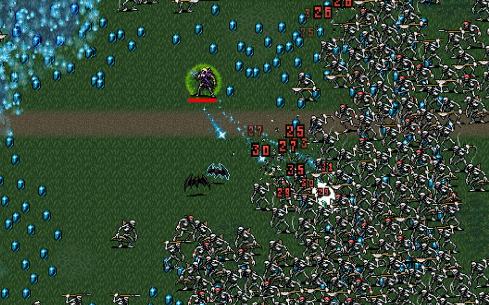\
[Source: Forbes](https://www.forbes.com/sites/paultassi/2022/11/14/goty-sleeper-pick-vampire-survivors-is-the-best-deal-in-gaming-this-year-at-5/)

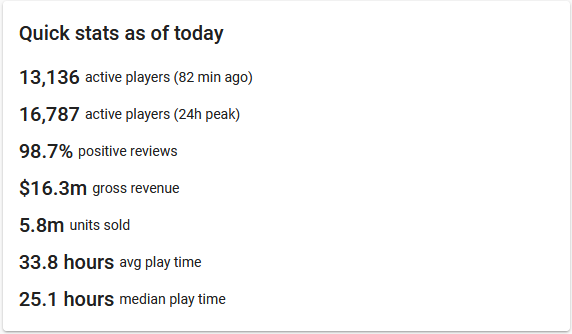

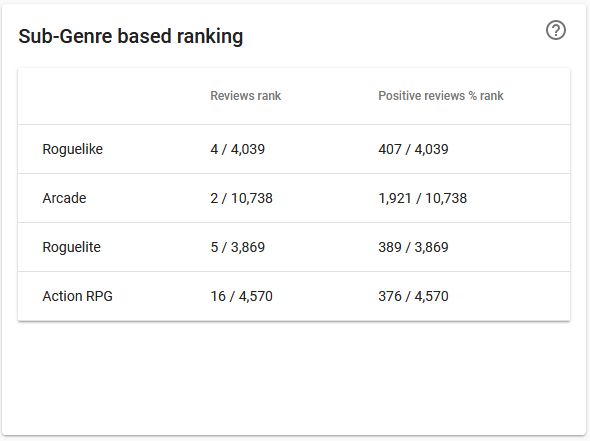\
[Source: VG Insights](https://vginsights.com/game/1794680)

Vampire Survivors has been a massive success critically, winning the BAFTA for best game of the year and the DICE award for best action game of the year, and commercially, having made ~$16m USD during since October 2022 in game sales.

Vampire Survivors is in the top 5 user ranking for the sub-genres of Roguelike, Arcade, Roguelite, and rated 16th best Action RPG on Steam.

Since it's release there have been over 30 titles released on Steam in the Survivors-Like genre, some of the notable ones are listed below.

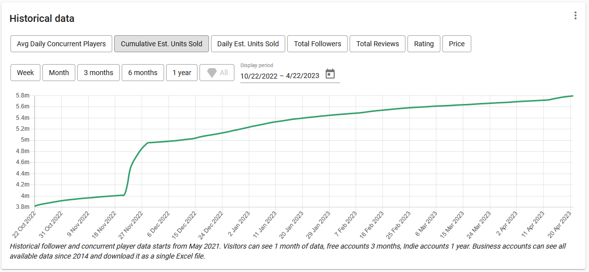\
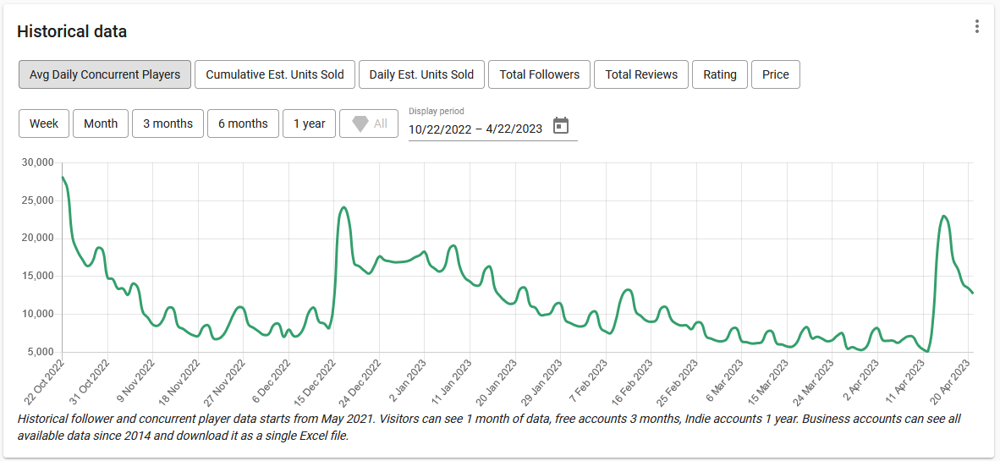\
[Source: VG Insights](https://vginsights.com/game/1794680)

Vampire Survivors has had a steady stream of sales since it's release. It has had major bumps in CCU with DLC releases, and continues to attract a large audience every day with it's current active daily peak about 90% of that of it's launch active daily peak.

## 20 minutes till dawn

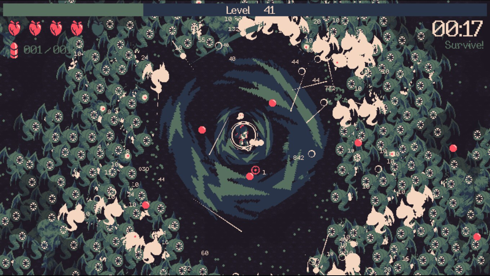\
[Source: Steam](https://store.steampowered.com/app/1966900/20_Minutes_Till_Dawn/)

20 minutes till dawn is a Survivors-Like game released ~5 months after Vampire Survivors.

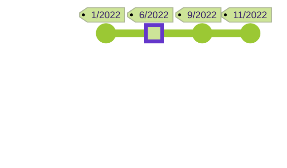
```mermaid
%%{init: {'theme':'forest', 'gitGraph': {'showBranches': false}, 'themeVariables': {
              'commitLabelColor': '#FFFFFF',
              'commitLabelBackground': '#00000000',
              'commitLabelFontSize': '16px'
  } }}%%

gitGraph
  commit id: "Vampire Survivors" type:NORMAL tag: "1/2022"
  commit id: "20 minutes till dawn" type:HIGHLIGHT tag: "6/2022"
  commit id: "Brotato" type:NORMAL tag: "9/2022"
  commit id: "Soulstone Survivors" type:NORMAL tag: "11/2022"
```
\
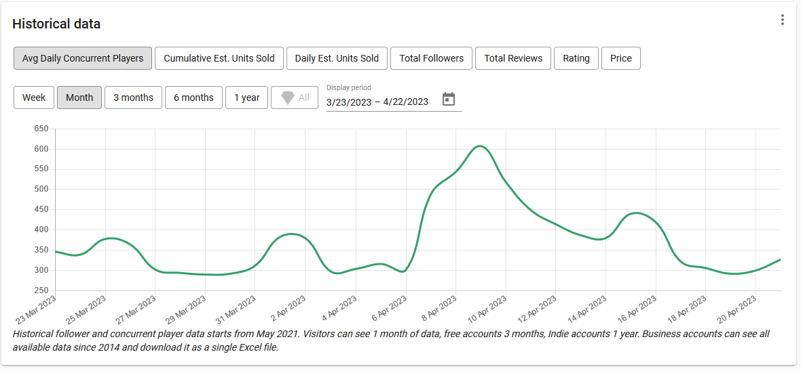\
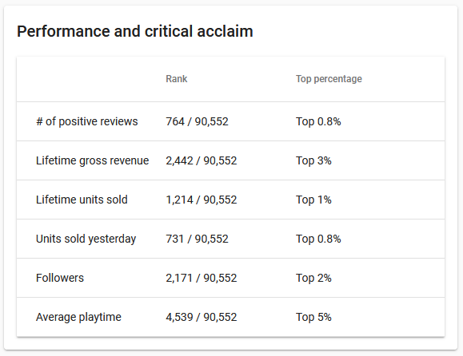\
[Source: VG Insights](https://vginsights.com/game/1966900)

20 minutes till dawn has had great critical success, in the top 1% of Steam games for positive reviews, and commercial success, ~$1.7m USD in games sold and in top 3% for gross revenue. 

It has sold around ~10% of the copies compared to Vampire Survivors.

It still has a consistent player base with ~450 daily players, in the top 500 of Steam games ranked by daily players.

## Brotato

Brotato is a Survivors-Like game released ~8 months after Vampire Survivors.

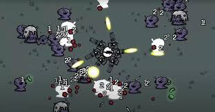\
[Source: Voxel Smash](https://voxelsmash.com/brotato-release-date/)

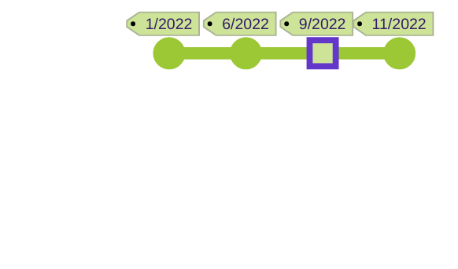
```mermaid
%%{init: {'theme':'forest', 'gitGraph': {'showBranches': false}, 'themeVariables': {
              'commitLabelColor': '#FFFFFF',
              'commitLabelBackground': '#00000000',
              'commitLabelFontSize': '16px'
  } }}%%

gitGraph
  commit id: "Vampire Survivors" type:NORMAL tag: "1/2022"
  commit id: "20 minutes till dawn" type:NORMAL tag: "6/2022"
  commit id: "Brotato" type:HIGHLIGHT tag: "9/2022"
  commit id: "Soulstone Survivors" type:NORMAL tag: "11/2022"
```

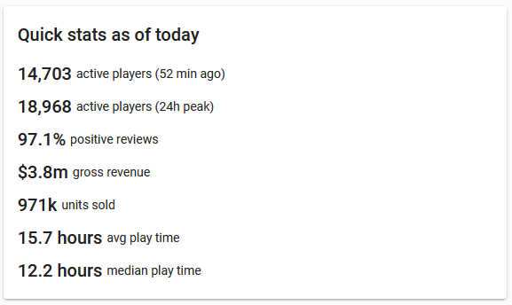
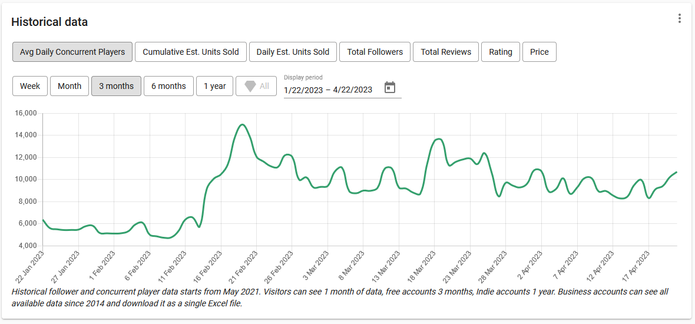
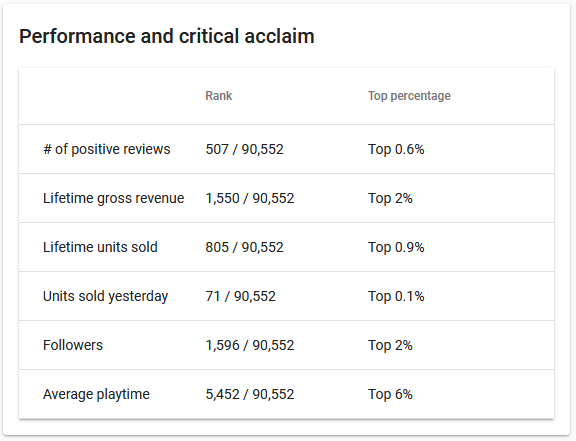\
[Source: VG Insights](https://vginsights.com/game/1942280)

Brotato has had great critical success, in the top 0.1% of Steam games for positive reviews, and commercial success, ~$3.8m USD in games sold and in top 2% for lifetime gross revenue. 

It has sold around ~20% of the copies compared to Vampire Survivors.

It still has a consistent player base with ~10,000 daily players, in the top 100 of Steam games ranked by daily players.

## Soulstone Survivors

Soulstone Survivors is a Survivors-Like game released ~11 months after Vampire Survivors.

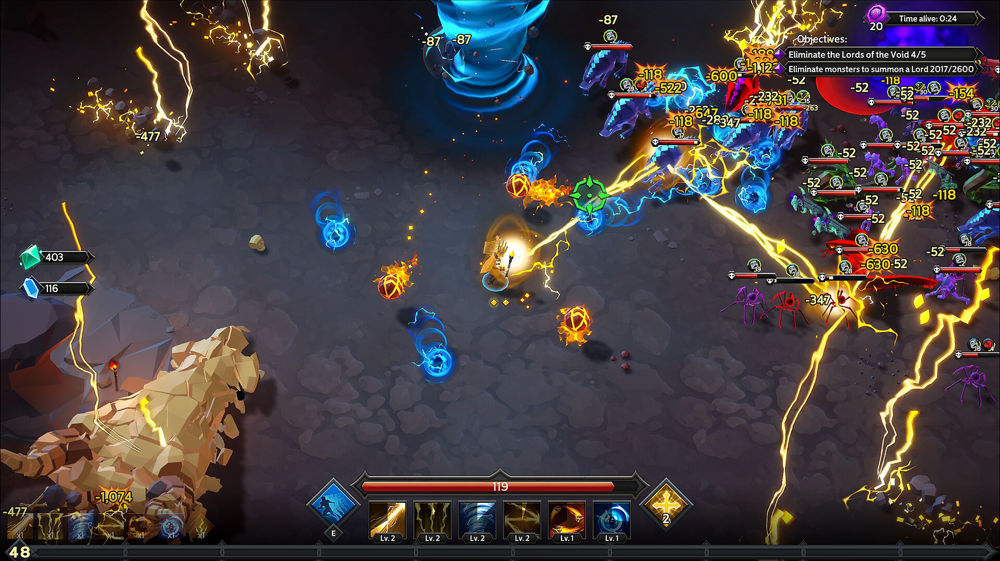\
[Source: Steam](https://store.steampowered.com/app/2066020/Soulstone_Survivors/)

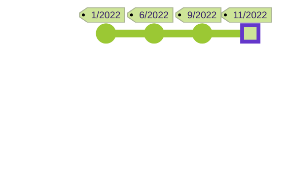
```mermaid
%%{init: {'theme':'forest', 'gitGraph': {'showBranches': false}, 'themeVariables': {
              'commitLabelColor': '#FFFFFF',
              'commitLabelBackground': '#00000000',
              'commitLabelFontSize': '16px'
  } }}%%

gitGraph
  commit id: "Vampire Survivors" type:NORMAL tag: "1/2022"
  commit id: "20 minutes till dawn" type:NORMAL tag: "6/2022"
  commit id: "Brotato" type:NORMAL tag: "9/2022"
  commit id: "Soulstone Survivors" type:HIGHLIGHT tag: "11/2022"
```

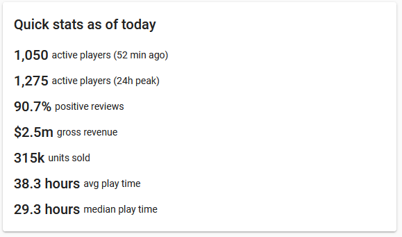
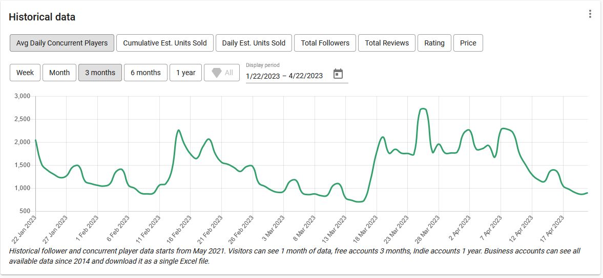
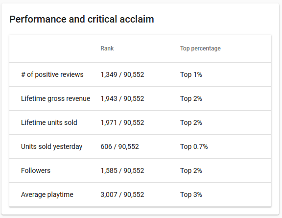\
[Source: VG Insights](https://vginsights.com/game/2066020)

Soulstone Survivors has had great critical success, in the top 1% of Steam games for positive reviews, and commercial success, ~$2.5m USD in games sold and in top 2% for lifetime gross revenue. 

It has sold around ~15% of the copies compared to Vampire Survivors.

It still has a consistent player base with ~1,500 daily players, in the top 200 of Steam games ranked by daily players.

## Similar Games Analysis

The critical and commercial success of Vampire Survivors demonstrates the demand for this new genre. It has had a steady stream of sales since launch and continues to attract a large CCU base with peaks from DLC's almost reaching the initial release peak, indicating it will have a long sales tail. 

However, it does not hold a monopoly over the genre that it popularized. Since it's release there has been over 30 significant competitors released on Steam, of which dozens have also had critical and commercial success, including those listed above.

Survivors-Like games tend to rank extremely highly in percentage of positive reviews, all three of the Survivors-Like games listed above are in the top 1% of number of positive steam reviews.

Survivors-Like games tend to sell extremely well, all three of the Survivors-Like games listed above are in the top 3% of lifetime gross revenue.

Further, there are few multiplayer Survivors-Like games and **no massively-multiplayer Survivors-like games**. The maximum number of players in a multiplayer Survivors-Like game is currently 2, in the game 'Bounty of One' which is in early access and follows the positive steam reviews (top 6% currently) and lifetime gross revenue (top 10% currently) trends seen in the aforementioned games.

## Final Analysis

Based on the genre supply and demand statistics it is clear there is a supply shortage for the main genre of Void Survivors, MMO, and three of the four sub-genres of Void Survivors.

There is a large market size for each of the genre's, with MMOs being the smallest at ~$500m USD and Action being the largest at ~$2000m USD.

The Survivors-Like genre is brand new (2022) and has seen dozens of successes in the last year, critically and commercially. Most Survivors-Like games are currently in the top 1% of number of positive reviews and in the top 3% of gross revenue, of all games on Steam.

The Survivors-Like genre has many competitors but has demonstrated huge demand. The average daily CCU of several Survivors-Like games is in the top 200 of all games on Steam.

There are few multiplayer Survivors-Like games and **no massively-multiplayer Survivors-Like games**. 

Void Survivors is positioned in a market which is undersupplied, has a massive market size, and huge player demand. Void Survivors will be the only game in the Survivors-Like genre that is massively-multiplayer, providing it unique market positioning in a high-demand market. 