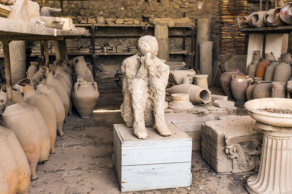

  

    Table of contents
  

  {: .text-delta }
1. TOC
{:toc}

----

## Story Summary

* A climate catastrophe rendered the world to an inert barren void.
* Survivors band together to grow life in the void and provide sanctuary to others.
* Void creatures of myth and legend seek to destroy all life and all sanctuaries.
* The story will be delivered through level design opposed to direct means.
* The game will allow for emergent storytelling to be created and shared within communities.
* Pictorial/image based story delivery for accessibility.

----

## Story

Global climate catastrophe struck the world after years of unbridled exploitation and negligence by the inhabitants. All records of the civilization, all progress and infrastructure, was reduced to ash. The only lingering reminder that the civilization existed are the occasional ashen remains of people stuck in the time when the catastrophe occurred.

Few survived the catastrophe and are confronted with an inert barren void replacing the industrious civilization before it. Those that did survive find themselves with an ability to summon life into the desolate void. These survivors bring hope for the world to return to a natural haven filled with the wonders of life.

Survivors band together to spread life in the void and provide sanctuary to all those that happen upon it. However, these sanctuary builders are not the only inhabitants within this new world. Attracted to life, like a moth to a flame, are void dwelling creatures of myth and legend. These void creatures contain the rage of the catastrophe and have an unrelenting desire to rid the world of all life.

Perhaps if enough survivors band together, the void creatures can be subdued and a sanctuary grown which replaces the void with the natural haven the world used to know.

----

## Why tell this story now?

This is a story which resonates with the feeling of helplessness that people feel in the face of climate change and ecosystem degradation on Earth. 

It inspires people through the promise that with enough people collaborating and contributing, the world can be saved and be a sanctuary for all. Only through inaction will the perpetuate and remain.

This story is a call to action and an instiller of hope.

----

## Story Delivery

This story of the world is delivered through dynamic storytelling mechanisms, through level design, rather than explicitly told to players, through text or NPCs. 

The game presents the tools for players to craft their own emergent stories within, such as how they grew their sanctuary, how long it lasted, how they responded to invaders, and what invaders overcame them. It is important for community-building that Void Survivors allows for stories that are crafted, shared, and treasured by communities.

Any story elements that are delivered directly will be delivered pictorially through images, such as in a comic book, to make the game as culturally accessible as possible without need for translation. A game that did this effectively was Hyper Light Drifter (see inspirations below).

----

## Inspirations

### Pompei

\
\
\
[Source: Pompeii History Online](https://www.pompeionline.net/en/archaeological-park-of-pompeii/history-of-pompeii)

### The void in 'Shadow and Bone'

\
\
\
[Source: Shadow and bone (Netflix)](https://www.netflix.com/title/80236319)

### Terra Nil

\
\
\
[Source: Terra Nil](https://store.steampowered.com/app/1593030/Terra_Nil/)

### Hyper Light Drifter

\
\
[Source: Hyper Light Drifter](https://store.steampowered.com/app/257850/Hyper_Light_Drifter/)